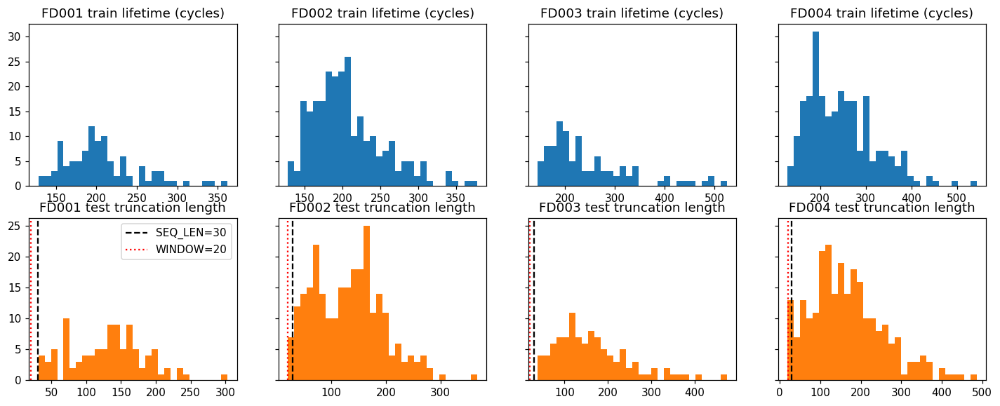
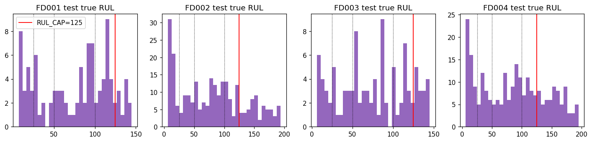
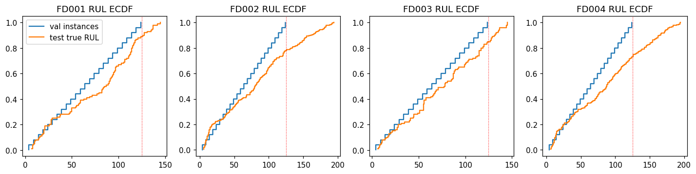
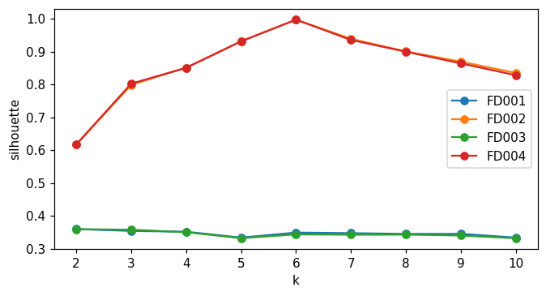
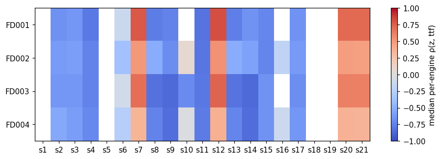
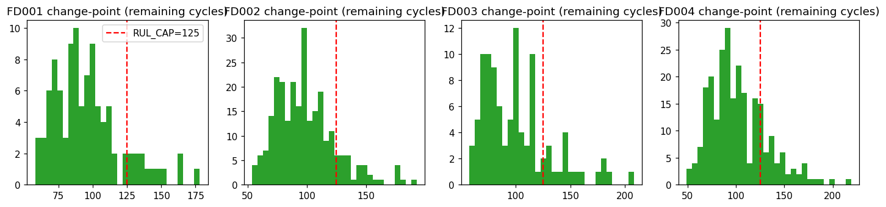

# Data audit — C-MAPSS FD001–FD004

Produced by `notebooks/00_data_audit.ipynb`; every number below is computed from `data/raw` by that notebook (nothing from prior knowledge of C-MAPSS). Analysis only: no pipeline code, config or decision status was changed.

**Test-set access (rule 3):** `test_FD00x.txt` read for truncation lengths only (A); `RUL_FD00x.txt` for its label distribution only (B, C). No model was fitted and no feature was computed on test data. All other sections use the training files.

**Uncertainty (rule 4):** distribution statistics carry a 95% percentile bootstrap CI (2000 resamples of engines, never rows); `n` = engines. Plain counts over the fixed files are exact and carry no CI.

**Audit parameters:** `N_BOOT` = 2000, `CI_LEVEL` = 0.95, `K_RANGE` = 2–10, `SIL_SAMPLE` = 10000, `VAL_STEP` = 5, `SIGN_SHARE` = 0.9, `MIN_SEG_GRID` = (5, 10, 20), `MIN_SEG_PRIMARY` = 10, `TAIL_LEN` = 30, `SLOPE_WINDOWS` = (15, 20, 30), `SMOOTH_WINDOWS` = (5, 15, 30), `EWM_SPAN` = 15. Seeds are listed under Reproducibility; the hinge fits are seedless (exhaustive grid + closed-form least squares).

## A. Structure

Counts are exact (census of the files). Medians carry a 95% bootstrap CI over engines.

| dataset | train units | train cycles/unit min | train cycles/unit median [95% CI] | train cycles/unit IQR | train cycles/unit max | test units | test length min | test length median [95% CI] | test length max | test units < SEQ_LEN (30) | test units < WINDOW (20) |
|---|---|---|---|---|---|---|---|---|---|---|---|
| FD001 | 100 | 128 | 199.0 [193.5, 207.0] (n=100) | 177–229 | 362 | 100 | 31 | 133.5 [123.0, 146.0] (n=100) | 303 | 0 | 0 |
| FD002 | 260 | 128 | 199.0 [194.0, 204.0] (n=260) | 174–230 | 378 | 259 | 21 | 132.0 [123.0, 144.0] (n=259) | 367 | 6 | 0 |
| FD003 | 100 | 145 | 220.5 [202.0, 232.5] (n=100) | 190–280 | 525 | 100 | 38 | 148.0 [130.0, 169.5] (n=100) | 475 | 0 | 0 |
| FD004 | 249 | 128 | 234.0 [223.0, 247.0] (n=249) | 190–290 | 543 | 248 | 19 | 153.5 [140.5, 170.0] (n=248) | 486 | 11 | 2 |

Test engines shorter than `SEQ_LEN` are left-padded with zeros by the LSTM (D11): FD001 0/100, FD002 6/259, FD003 0/100, FD004 11/248. Test engines shorter than `WINDOW` get rolling features from fewer than `WINDOW` cycles: FD001 0, FD002 0, FD003 0, FD004 2.

## B. Test label distribution

Label distribution only (allowed by rule 3); no prediction is involved.

| dataset | n | min | median [95% CI] | IQR | max | critical [0,25) | urgent [25,50) | monitor [50,100) | healthy [100,∞) | true RUL > 125 |
|---|---|---|---|---|---|---|---|---|---|---|
| FD001 | 100 | 7 | 86.0 [65.5, 95.0] (n=100) | 33–112 | 145 | 19 | 11 | 36 | 34 | 11 |
| FD002 | 259 | 6 | 80.0 [73.0, 88.0] (n=259) | 35–121 | 194 | 58 | 29 | 79 | 93 | 57 |
| FD003 | 100 | 6 | 77.5 [58.0, 87.0] (n=100) | 43–115 | 145 | 15 | 14 | 38 | 33 | 15 |
| FD004 | 248 | 6 | 88.0 [76.0, 96.0] (n=248) | 36–127 | 195 | 49 | 30 | 67 | 102 | 67 |

**The headline metric (critical-zone RMSE, true RUL in [0, 25)) rests on 19 engines (FD001), 58 engines (FD002), 15 engines (FD003), 49 engines (FD004) — 141 of 707 test engines pooled.** Each per-dataset headline number is an RMSE over that many residuals, one per engine.

## C. Validation realism

`make_val_instances` (nb02 cell 2, logic copied unchanged; step = 5) applied to the pipeline's validation engines (`split_engines`, `SPLIT_FRAC` = 0.8), compared with the test true-RUL labels. KS = two-sample Kolmogorov–Smirnov statistic (0 = identical distributions). The CI resamples validation engines (with all their instances) and test engines independently; a percentile bootstrap of KS is biased upward, so a point estimate can sit at or below the CI's lower end.

| dataset | val engines | val instances | engines using fallback (no RUL<cap) | val RUL range | test engines | test RUL ≥ 125 (unreachable by val) | KS vs all test [95% CI] | KS vs test RUL<125 [95% CI] | test n (RUL<125) | val median | test median |
|---|---|---|---|---|---|---|---|---|---|---|---|
| FD001 | 20 | 500 | 0 | 4–124 | 100 | 11 | 0.200 [0.130, 0.300] | 0.136 [0.091, 0.248] | 89 | 64 | 86 |
| FD002 | 52 | 1300 | 0 | 4–124 | 259 | 57 | 0.226 [0.180, 0.280] | 0.137 [0.087, 0.202] | 202 | 64 | 80 |
| FD003 | 20 | 500 | 0 | 4–124 | 100 | 15 | 0.180 [0.120, 0.270] | 0.075 [0.073, 0.188] | 85 | 64 | 78 |
| FD004 | 50 | 1250 | 0 | 4–124 | 248 | 67 | 0.270 [0.218, 0.331] | 0.101 [0.068, 0.173] | 181 | 64 | 88 |

- By construction validation instances have RUL 4–124 (every 5th cycle with capped RUL < 125), and every validation engine contributes the same near-uniform spread, so the pooled validation median is 64, 64, 64, 64 vs test medians 86, 80, 78, 88 (FD001–FD004).
- Test engines with true RUL ≥ the cap have no validation counterpart: FD001 11/100, FD002 57/259, FD003 15/100, FD004 67/248.
- Against the full test distribution the KS CI excludes 0 on every dataset; restricted to test engines with RUL below the cap the distance is smaller (table). nb02's comment that the instances match "the test-set distribution" holds at best for the RUL < cap part.

## D. Operating regimes

KMeans (n_init = 10, random_state = 0) on standardized op1–op3, train rows only. Silhouette on a 10000-row sample (random_state = 0).

| dataset | k=2 | k=3 | k=4 | k=5 | k=6 | k=7 | k=8 | k=9 | k=10 |
|---|---|---|---|---|---|---|---|---|---|
| FD001 | 0.3597 | 0.3542 | 0.3516 | 0.3337 | 0.3491 | 0.3473 | 0.345 | 0.3453 | 0.3337 |
| FD002 | 0.6165 | 0.7987 | 0.8508 | 0.9308 | 0.9971 | 0.9387 | 0.9003 | 0.8693 | 0.835 |
| FD003 | 0.3592 | 0.3577 | 0.3502 | 0.3321 | 0.3436 | 0.3426 | 0.343 | 0.3402 | 0.332 |
| FD004 | 0.6176 | 0.8023 | 0.8505 | 0.9313 | 0.9971 | 0.9353 | 0.8995 | 0.8641 | 0.8279 |

Raw spread of the operating settings (train rows):

| dataset | raw std op1 | raw std op2 | raw std op3 |
|---|---|---|---|
| FD001 | 0.002187 | 0.000293 | 0.0 |
| FD002 | 14.747376 | 0.310016 | 14.237735 |
| FD003 | 0.002194 | 0.000294 | 0.0 |
| FD004 | 14.780722 | 0.310703 | 14.251954 |

Forced 2-way split: the largest shift it induces in any non-constant sensor, in pooled within-cluster SDs (a real regime boundary moves sensors; noise does not):

| dataset | largest forced-split shift (pooled SD) | sensor | sensors single-valued per cluster but differing |
|---|---|---|---|
| FD001 | 0.032 | s13 | 0 |
| FD002 | 6.674 | s10 | 0 |
| FD003 | 0.031 | s14 | 0 |
| FD004 | 6.583 | s10 | 0 |

**Choice.** FD001: single regime — op settings vary by at most 0.0022 (raw-unit SD), best silhouette 0.360 (k = 2), a forced split moves no sensor by more than 0.032 SD. FD003: single regime — op settings vary by at most 0.0022 (raw-unit SD), best silhouette 0.359 (k = 2), a forced split moves no sensor by more than 0.031 SD. FD002: k = 6 (silhouette 0.9971; next best 0.9387). FD004: k = 6 (silhouette 0.9971; next best 0.9353).

Cluster centers at the silhouette argmax, raw units:

**FD002**

| op1 | op2 | op3 | train rows |
|---|---|---|---|
| 0.002 | 0.0 | 100.0 | 8044 |
| 10.003 | 0.25 | 100.0 | 8096 |
| 20.003 | 0.701 | 100.0 | 8122 |
| 25.003 | 0.621 | 60.0 | 8002 |
| 35.003 | 0.841 | 100.0 | 8037 |
| 42.003 | 0.84 | 100.0 | 13458 |

**FD004**

| op1 | op2 | op3 | train rows |
|---|---|---|---|
| 0.002 | 0.0 | 100.0 | 9238 |
| 10.003 | 0.251 | 100.0 | 9224 |
| 20.003 | 0.701 | 100.0 | 9091 |
| 25.003 | 0.621 | 60.0 | 9139 |
| 35.003 | 0.841 | 100.0 | 9162 |
| 42.003 | 0.84 | 100.0 | 15395 |

**D05 — stability of the pipeline's own regime model** (k = 6, n_init = 10) across random_state 0–9: adjusted Rand index vs random_state = 0, min–max: FD001 0.873–1.000, FD002 1.000–1.000, FD003 0.939–1.000, FD004 1.000–1.000 (FD001/FD003 listed for completeness; the pipeline does not cluster them).

**D06 — do the normalization fallbacks fire on the pipeline's train/val split?** (regime model fit on the train split, applied to the validation split, as `add_features` does):

| check | FD002 | FD004 |
|---|---|---|
| train-split rows per regime (min) | 6410 | 7250 |
| val regimes unseen in train | 0 | 0 |
| KEEP sensor × regime cells with std = 0 | 0 | 0 |
| KEEP sensor × regime cells with std NaN | 0 | 0 |

## E. Sensor informativeness

Within-regime z-score with the regimes chosen in D. ρ = per-engine Spearman correlation between the normalized sensor and time to failure (uncapped). Classes: *constant* = a single value within every regime; *flat* = median |ρ| CI overlaps the noise baseline (`ttf` permuted within each engine); *informative* otherwise — *consistent* if ≥ 90% of engines share the majority sign, else *mixed* (the sensor rises in some engines and falls in others).

**FD001** — 1 regime(s), 100 engines

| sensor | within-regime std (raw units) | within/total variance | median ρ(z, ttf) [95% CI] | ρ IQR across engines | median \|ρ\| [95% CI] | noise baseline median \|ρ\| [95% CI] | share of engines with majority sign | engines with ρ undefined | class | in KEEP |
|---|---|---|---|---|---|---|---|---|---|---|
| s1 | 0 | n/a (1 regime) | — | — | — | — | — | 100 | constant | no |
| s2 | 0.5001 | n/a (1 regime) | -0.671 [-0.682, -0.649] (n=100) | -0.707 to -0.625 | 0.671 [0.652, 0.683] | 0.061 [0.046, 0.065] | 1.00 [1.00, 1.00] | 0 | informative, consistent | yes |
| s3 | 6.131 | n/a (1 regime) | -0.637 [-0.659, -0.618] (n=100) | -0.678 to -0.585 | 0.637 [0.618, 0.658] | 0.049 [0.040, 0.055] | 1.00 [1.00, 1.00] | 0 | informative, consistent | yes |
| s4 | 9.001 | n/a (1 regime) | -0.784 [-0.791, -0.775] (n=100) | -0.804 to -0.759 | 0.784 [0.775, 0.791] | 0.044 [0.036, 0.055] | 1.00 [1.00, 1.00] | 0 | informative, consistent | yes |
| s5 | 0 | n/a (1 regime) | — | — | — | — | — | 100 | constant | no |
| s6 | 0.001389 | n/a (1 regime) | -0.126 [-0.166, -0.101] (n=62) | -0.192 to -0.083 | 0.126 [0.101, 0.165] | 0.043 [0.037, 0.056] | 0.98 [0.95, 1.00] | 38 | informative, consistent | no |
| s7 | 0.8851 | n/a (1 regime) | 0.774 [0.758, 0.783] (n=100) | 0.715 to 0.802 | 0.774 [0.759, 0.783] | 0.056 [0.045, 0.065] | 1.00 [1.00, 1.00] | 0 | informative, consistent | yes |
| s8 | 0.07099 | n/a (1 regime) | -0.768 [-0.786, -0.725] (n=100) | -0.816 to -0.603 | 0.768 [0.729, 0.785] | 0.046 [0.039, 0.057] | 1.00 [1.00, 1.00] | 0 | informative, consistent | yes |
| s9 | 22.08 | n/a (1 regime) | -0.739 [-0.846, -0.463] (n=100) | -0.911 to 0.193 | 0.751 [0.624, 0.843] | 0.046 [0.034, 0.051] | 0.71 [0.61, 0.80] | 0 | informative, mixed | yes |
| s10 | 0 | n/a (1 regime) | — | — | — | — | — | 100 | constant | no |
| s11 | 0.2671 | n/a (1 regime) | -0.819 [-0.824, -0.806] (n=100) | -0.848 to -0.780 | 0.819 [0.805, 0.824] | 0.050 [0.035, 0.063] | 1.00 [1.00, 1.00] | 0 | informative, consistent | yes |
| s12 | 0.7376 | n/a (1 regime) | 0.808 [0.782, 0.820] (n=100) | 0.748 to 0.833 | 0.808 [0.782, 0.820] | 0.042 [0.032, 0.059] | 1.00 [1.00, 1.00] | 0 | informative, consistent | yes |
| s13 | 0.07192 | n/a (1 regime) | -0.762 [-0.788, -0.725] (n=100) | -0.821 to -0.606 | 0.762 [0.726, 0.788] | 0.051 [0.043, 0.059] | 1.00 [1.00, 1.00] | 0 | informative, consistent | yes |
| s14 | 19.08 | n/a (1 regime) | -0.663 [-0.825, -0.023] (n=100) | -0.906 to 0.563 | 0.767 [0.732, 0.842] | 0.048 [0.038, 0.059] | 0.60 [0.50, 0.70] | 0 | informative, mixed | yes |
| s15 | 0.03751 | n/a (1 regime) | -0.721 [-0.733, -0.704] (n=100) | -0.746 to -0.675 | 0.721 [0.703, 0.733] | 0.039 [0.035, 0.051] | 1.00 [1.00, 1.00] | 0 | informative, consistent | yes |
| s16 | 0 | n/a (1 regime) | — | — | — | — | — | 100 | constant | no |
| s17 | 1.549 | n/a (1 regime) | -0.661 [-0.687, -0.646] (n=100) | -0.712 to -0.617 | 0.661 [0.645, 0.686] | 0.047 [0.037, 0.058] | 1.00 [1.00, 1.00] | 0 | informative, consistent | yes |
| s18 | 0 | n/a (1 regime) | — | — | — | — | — | 100 | constant | no |
| s19 | 0 | n/a (1 regime) | — | — | — | — | — | 100 | constant | no |
| s20 | 0.1807 | n/a (1 regime) | 0.706 [0.690, 0.720] (n=100) | 0.667 to 0.738 | 0.706 [0.690, 0.720] | 0.051 [0.038, 0.069] | 1.00 [1.00, 1.00] | 0 | informative, consistent | yes |
| s21 | 0.1083 | n/a (1 regime) | 0.708 [0.689, 0.729] (n=100) | 0.658 to 0.750 | 0.708 [0.689, 0.729] | 0.041 [0.029, 0.054] | 1.00 [1.00, 1.00] | 0 | informative, consistent | yes |

**FD002** — 6 regime(s), 260 engines

| sensor | within-regime std (raw units) | within/total variance | median ρ(z, ttf) [95% CI] | ρ IQR across engines | median \|ρ\| [95% CI] | noise baseline median \|ρ\| [95% CI] | share of engines with majority sign | engines with ρ undefined | class | in KEEP |
|---|---|---|---|---|---|---|---|---|---|---|
| s1 | 0 | 0.000 | — | — | — | — | — | 260 | constant | no |
| s2 | 0.4449 | 0.000 | -0.617 [-0.629, -0.606] (n=260) | -0.664 to -0.564 | 0.617 [0.606, 0.630] | 0.054 [0.047, 0.059] | 1.00 [1.00, 1.00] | 0 | informative, consistent | yes |
| s3 | 5.687 | 0.003 | -0.598 [-0.609, -0.590] (n=260) | -0.635 to -0.555 | 0.598 [0.590, 0.609] | 0.050 [0.043, 0.060] | 1.00 [1.00, 1.00] | 0 | informative, consistent | yes |
| s4 | 7.848 | 0.004 | -0.739 [-0.749, -0.730] (n=260) | -0.775 to -0.703 | 0.739 [0.731, 0.749] | 0.046 [0.041, 0.053] | 1.00 [1.00, 1.00] | 0 | informative, consistent | yes |
| s5 | 0 | 0.000 | — | — | — | — | — | 260 | constant | no |
| s6 | 0.004009 | 0.000 | -0.373 [-0.392, -0.354] (n=260) | -0.440 to -0.306 | 0.373 [0.355, 0.391] | 0.049 [0.042, 0.057] | 1.00 [1.00, 1.00] | 0 | informative, consistent | no |
| s7 | 0.5901 | 0.000 | 0.504 [0.493, 0.524] (n=260) | 0.438 to 0.561 | 0.504 [0.493, 0.524] | 0.046 [0.041, 0.052] | 1.00 [1.00, 1.00] | 0 | informative, consistent | yes |
| s8 | 0.2211 | 0.000 | -0.517 [-0.600, -0.393] (n=260) | -0.733 to -0.070 | 0.517 [0.394, 0.598] | 0.046 [0.040, 0.052] | 0.83 [0.78, 0.87] | 0 | informative, mixed | yes |
| s9 | 17.44 | 0.003 | -0.693 [-0.740, -0.578] (n=260) | -0.874 to 0.048 | 0.699 [0.649, 0.740] | 0.047 [0.041, 0.053] | 0.73 [0.68, 0.79] | 0 | informative, mixed | yes |
| s10 | 0.001983 | 0.000 | 0.069 [0.062, 0.083] (n=260) | 0.018 to 0.132 | 0.080 [0.068, 0.091] | 0.047 [0.041, 0.057] | 0.80 [0.75, 0.85] | 0 | informative, mixed | no |
| s11 | 0.2392 | 0.005 | -0.799 [-0.805, -0.791] (n=260) | -0.822 to -0.764 | 0.799 [0.791, 0.805] | 0.048 [0.041, 0.054] | 1.00 [1.00, 1.00] | 0 | informative, consistent | yes |
| s12 | 0.4785 | 0.000 | 0.538 [0.524, 0.550] (n=260) | 0.456 to 0.595 | 0.538 [0.524, 0.551] | 0.050 [0.041, 0.060] | 1.00 [1.00, 1.00] | 0 | informative, consistent | yes |
| s13 | 0.2361 | 0.000 | -0.521 [-0.599, -0.380] (n=260) | -0.723 to -0.085 | 0.521 [0.382, 0.599] | 0.048 [0.044, 0.054] | 0.82 [0.77, 0.86] | 0 | informative, mixed | yes |
| s14 | 15.59 | 0.034 | -0.584 [-0.676, -0.362] (n=260) | -0.874 to 0.501 | 0.714 [0.681, 0.761] | 0.050 [0.038, 0.055] | 0.60 [0.54, 0.66] | 0 | informative, mixed | yes |
| s15 | 0.03874 | 0.003 | -0.734 [-0.742, -0.728] (n=260) | -0.768 to -0.688 | 0.734 [0.728, 0.743] | 0.042 [0.036, 0.050] | 1.00 [1.00, 1.00] | 0 | informative, consistent | yes |
| s16 | 0.001595 | 0.115 | -0.199 [-0.208, -0.187] (n=260) | -0.241 to -0.143 | 0.199 [0.187, 0.208] | 0.044 [0.040, 0.050] | 1.00 [0.99, 1.00] | 0 | informative, consistent | no |
| s17 | 1.43 | 0.003 | -0.625 [-0.636, -0.618] (n=260) | -0.668 to -0.583 | 0.625 [0.618, 0.635] | 0.046 [0.040, 0.052] | 1.00 [1.00, 1.00] | 0 | informative, consistent | yes |
| s18 | 0 | 0.000 | — | — | — | — | — | 260 | constant | no |
| s19 | 0 | 0.000 | — | — | — | — | — | 260 | constant | no |
| s20 | 0.1315 | 0.000 | 0.470 [0.456, 0.482] (n=260) | 0.418 to 0.524 | 0.470 [0.456, 0.481] | 0.049 [0.043, 0.055] | 1.00 [1.00, 1.00] | 0 | informative, consistent | yes |
| s21 | 0.07811 | 0.000 | 0.464 [0.449, 0.478] (n=260) | 0.403 to 0.520 | 0.464 [0.449, 0.478] | 0.049 [0.041, 0.053] | 1.00 [1.00, 1.00] | 0 | informative, consistent | yes |

**FD003** — 1 regime(s), 100 engines

| sensor | within-regime std (raw units) | within/total variance | median ρ(z, ttf) [95% CI] | ρ IQR across engines | median \|ρ\| [95% CI] | noise baseline median \|ρ\| [95% CI] | share of engines with majority sign | engines with ρ undefined | class | in KEEP |
|---|---|---|---|---|---|---|---|---|---|---|
| s1 | 0 | n/a (1 regime) | — | — | — | — | — | 100 | constant | no |
| s2 | 0.523 | n/a (1 regime) | -0.635 [-0.648, -0.624] (n=100) | -0.680 to -0.594 | 0.635 [0.624, 0.648] | 0.045 [0.035, 0.055] | 1.00 [1.00, 1.00] | 0 | informative, consistent | yes |
| s3 | 6.81 | n/a (1 regime) | -0.639 [-0.647, -0.630] (n=100) | -0.672 to -0.609 | 0.639 [0.630, 0.647] | 0.046 [0.039, 0.056] | 1.00 [1.00, 1.00] | 0 | informative, consistent | yes |
| s4 | 9.773 | n/a (1 regime) | -0.742 [-0.760, -0.729] (n=100) | -0.795 to -0.716 | 0.742 [0.729, 0.759] | 0.049 [0.030, 0.063] | 1.00 [1.00, 1.00] | 0 | informative, consistent | yes |
| s5 | 0 | n/a (1 regime) | — | — | — | — | — | 100 | constant | no |
| s6 | 0.01812 | n/a (1 regime) | -0.083 [-0.115, -0.052] (n=82) | -0.169 to 0.144 | 0.167 [0.129, 0.214] | 0.044 [0.036, 0.055] | 0.66 [0.56, 0.76] | 18 | informative, mixed | no |
| s7 | 3.437 | n/a (1 regime) | 0.692 [-0.888, 0.740] (n=100) | -0.926 to 0.782 | 0.820 [0.797, 0.888] | 0.035 [0.029, 0.054] | 0.56 [0.46, 0.66] | 0 | informative, mixed | yes |
| s8 | 0.1583 | n/a (1 regime) | -0.822 [-0.840, -0.797] (n=100) | -0.858 to -0.752 | 0.822 [0.797, 0.840] | 0.046 [0.032, 0.053] | 1.00 [1.00, 1.00] | 0 | informative, consistent | yes |
| s9 | 19.98 | n/a (1 regime) | -0.860 [-0.872, -0.840] (n=100) | -0.890 to -0.568 | 0.860 [0.841, 0.873] | 0.047 [0.035, 0.066] | 0.84 [0.76, 0.91] | 0 | informative, mixed | yes |
| s10 | 0.003485 | n/a (1 regime) | -0.700 [-0.728, -0.670] (n=44) | -0.755 to -0.653 | 0.700 [0.669, 0.725] | 0.031 [0.025, 0.049] | 1.00 [1.00, 1.00] | 56 | informative, consistent | no |
| s11 | 0.3001 | n/a (1 regime) | -0.795 [-0.808, -0.789] (n=100) | -0.825 to -0.765 | 0.795 [0.788, 0.808] | 0.051 [0.040, 0.060] | 1.00 [1.00, 1.00] | 0 | informative, consistent | yes |
| s12 | 3.255 | n/a (1 regime) | 0.733 [-0.898, 0.770] (n=100) | -0.936 to 0.803 | 0.846 [0.819, 0.898] | 0.036 [0.026, 0.046] | 0.56 [0.46, 0.65] | 0 | informative, mixed | yes |
| s13 | 0.1581 | n/a (1 regime) | -0.818 [-0.837, -0.806] (n=100) | -0.861 to -0.740 | 0.818 [0.806, 0.837] | 0.050 [0.035, 0.059] | 1.00 [1.00, 1.00] | 0 | informative, consistent | yes |
| s14 | 16.5 | n/a (1 regime) | -0.864 [-0.877, -0.829] (n=100) | -0.889 to -0.163 | 0.864 [0.834, 0.878] | 0.049 [0.039, 0.061] | 0.77 [0.68, 0.85] | 0 | informative, mixed | yes |
| s15 | 0.06051 | n/a (1 regime) | -0.657 [-0.685, 0.709] (n=100) | -0.733 to 0.745 | 0.740 [0.731, 0.748] | 0.043 [0.029, 0.050] | 0.56 [0.46, 0.66] | 0 | informative, mixed | yes |
| s16 | 0 | n/a (1 regime) | — | — | — | — | — | 100 | constant | no |
| s17 | 1.761 | n/a (1 regime) | -0.684 [-0.695, -0.672] (n=100) | -0.715 to -0.650 | 0.684 [0.672, 0.695] | 0.044 [0.038, 0.057] | 1.00 [1.00, 1.00] | 0 | informative, consistent | yes |
| s18 | 0 | n/a (1 regime) | — | — | — | — | — | 100 | constant | no |
| s19 | 0 | n/a (1 regime) | — | — | — | — | — | 100 | constant | no |
| s20 | 0.2489 | n/a (1 regime) | 0.615 [-0.615, 0.662] (n=100) | -0.677 to 0.716 | 0.700 [0.680, 0.713] | 0.045 [0.035, 0.053] | 0.56 [0.46, 0.66] | 0 | informative, mixed | yes |
| s21 | 0.1492 | n/a (1 regime) | 0.613 [-0.617, 0.665] (n=100) | -0.680 to 0.704 | 0.695 [0.683, 0.706] | 0.047 [0.037, 0.063] | 0.56 [0.46, 0.65] | 0 | informative, mixed | yes |

**FD004** — 6 regime(s), 249 engines

| sensor | within-regime std (raw units) | within/total variance | median ρ(z, ttf) [95% CI] | ρ IQR across engines | median \|ρ\| [95% CI] | noise baseline median \|ρ\| [95% CI] | share of engines with majority sign | engines with ρ undefined | class | in KEEP |
|---|---|---|---|---|---|---|---|---|---|---|
| s1 | 0 | 0.000 | — | — | — | — | — | 249 | constant | no |
| s2 | 0.4798 | 0.000 | -0.546 [-0.569, -0.530] (n=249) | -0.629 to -0.497 | 0.546 [0.532, 0.569] | 0.045 [0.041, 0.049] | 1.00 [1.00, 1.00] | 0 | informative, consistent | yes |
| s3 | 6.478 | 0.004 | -0.608 [-0.613, -0.599] (n=249) | -0.642 to -0.566 | 0.608 [0.598, 0.614] | 0.041 [0.034, 0.046] | 1.00 [1.00, 1.00] | 0 | informative, consistent | yes |
| s4 | 8.905 | 0.006 | -0.715 [-0.722, -0.706] (n=249) | -0.753 to -0.675 | 0.715 [0.706, 0.722] | 0.043 [0.038, 0.052] | 1.00 [1.00, 1.00] | 0 | informative, consistent | yes |
| s5 | 0 | 0.000 | — | — | — | — | — | 249 | constant | no |
| s6 | 0.01492 | 0.000 | -0.265 [-0.279, -0.216] (n=249) | -0.371 to 0.103 | 0.327 [0.303, 0.346] | 0.041 [0.036, 0.049] | 0.68 [0.63, 0.73] | 0 | informative, mixed | no |
| s7 | 2.012 | 0.000 | 0.351 [0.293, 0.386] (n=249) | -0.822 to 0.480 | 0.541 [0.516, 0.580] | 0.043 [0.037, 0.050] | 0.59 [0.53, 0.65] | 0 | informative, mixed | yes |
| s8 | 0.2128 | 0.000 | -0.735 [-0.767, -0.687] (n=249) | -0.827 to -0.291 | 0.735 [0.684, 0.766] | 0.042 [0.036, 0.047] | 0.85 [0.80, 0.89] | 0 | informative, mixed | yes |
| s9 | 17.8 | 0.003 | -0.837 [-0.847, -0.822] (n=249) | -0.868 to -0.531 | 0.837 [0.823, 0.847] | 0.044 [0.040, 0.049] | 0.85 [0.80, 0.90] | 0 | informative, mixed | yes |
| s10 | 0.005274 | 0.002 | -0.022 [-0.067, 0.027] (n=249) | -0.613 to 0.091 | 0.158 [0.137, 0.197] | 0.042 [0.039, 0.048] | 0.51 [0.46, 0.58] | 0 | informative, mixed | no |
| s11 | 0.2809 | 0.007 | -0.777 [-0.784, -0.769] (n=249) | -0.815 to -0.751 | 0.777 [0.770, 0.785] | 0.043 [0.037, 0.047] | 1.00 [1.00, 1.00] | 0 | informative, consistent | yes |
| s12 | 1.892 | 0.000 | 0.376 [0.298, 0.426] (n=249) | -0.850 to 0.510 | 0.572 [0.547, 0.604] | 0.043 [0.037, 0.048] | 0.59 [0.53, 0.65] | 0 | informative, mixed | yes |
| s13 | 0.225 | 0.000 | -0.734 [-0.766, -0.688] (n=249) | -0.827 to -0.301 | 0.734 [0.692, 0.767] | 0.042 [0.036, 0.050] | 0.86 [0.81, 0.90] | 0 | informative, mixed | yes |
| s14 | 15.53 | 0.033 | -0.846 [-0.856, -0.829] (n=249) | -0.877 to -0.340 | 0.846 [0.829, 0.855] | 0.044 [0.038, 0.050] | 0.78 [0.72, 0.83] | 0 | informative, mixed | yes |
| s15 | 0.06775 | 0.008 | -0.657 [-0.680, -0.620] (n=249) | -0.742 to 0.775 | 0.757 [0.750, 0.764] | 0.050 [0.041, 0.054] | 0.59 [0.53, 0.65] | 0 | informative, mixed | yes |
| s16 | 0.001418 | 0.092 | -0.124 [-0.136, -0.110] (n=249) | -0.173 to -0.074 | 0.124 [0.110, 0.135] | 0.040 [0.035, 0.048] | 0.95 [0.92, 0.97] | 0 | informative, consistent | no |
| s17 | 1.635 | 0.003 | -0.635 [-0.641, -0.628] (n=249) | -0.662 to -0.600 | 0.635 [0.628, 0.641] | 0.041 [0.035, 0.046] | 1.00 [1.00, 1.00] | 0 | informative, consistent | yes |
| s18 | 0 | 0.000 | — | — | — | — | — | 249 | constant | no |
| s19 | 0 | 0.000 | — | — | — | — | — | 249 | constant | no |
| s20 | 0.1688 | 0.000 | 0.365 [0.313, 0.392] (n=249) | -0.472 to 0.450 | 0.462 [0.450, 0.471] | 0.053 [0.046, 0.059] | 0.59 [0.53, 0.65] | 0 | informative, mixed | yes |
| s21 | 0.1011 | 0.000 | 0.357 [0.312, 0.384] (n=249) | -0.467 to 0.462 | 0.466 [0.460, 0.474] | 0.042 [0.034, 0.052] | 0.59 [0.53, 0.65] | 0 | informative, mixed | yes |

**Disagreements with `config.KEEP`:**

| dataset | informative, not in KEEP | in KEEP, not informative | KEEP sensors with mixed direction | direction-consistent informative (used in F) |
|---|---|---|---|---|
| FD001 | s6 | — | s9, s14 | s2, s3, s4, s6, s7, s8, s11, s12, s13, s15, s17, s20, s21 |
| FD002 | s6, s10, s16 | — | s8, s9, s13, s14 | s2, s3, s4, s6, s7, s11, s12, s15, s16, s17, s20, s21 |
| FD003 | s6, s10 | — | s7, s9, s12, s14, s15, s20, s21 | s2, s3, s4, s8, s10, s11, s13, s17 |
| FD004 | s6, s10, s16 | — | s7, s8, s9, s12, s13, s14, s15, s20, s21 | s2, s3, s4, s11, s16, s17 |

**Per-regime vs global normalization (D03).** Spearman ρ is invariant to a global affine map, so ρ on raw values equals ρ on a global z-score:

| dataset | mean \|ρ\| over KEEP, raw (= global z) | mean \|ρ\| over KEEP, within-regime z | paired Δ |
|---|---|---|---|
| FD001 | 0.708 [0.698, 0.727] (n=100) | 0.708 [0.698, 0.728] (n=100) | 0.000 [0.000, 0.000] (n=100) |
| FD002 | 0.139 [0.135, 0.144] (n=260) | 0.584 [0.568, 0.597] (n=260) | 0.444 [0.434, 0.451] (n=260) |
| FD003 | 0.756 [0.744, 0.765] (n=100) | 0.756 [0.743, 0.765] (n=100) | 0.000 [0.000, 0.000] (n=100) |
| FD004 | 0.153 [0.147, 0.159] (n=249) | 0.651 [0.634, 0.670] (n=249) | 0.462 [0.450, 0.476] (n=249) |

## F. RUL-cap evidence: per-engine change-point

Health signal = mean of the direction-consistent informative sensors (E), oriented to rise toward failure. Per engine, `y = a + b·max(0, t − τ)` fitted by exhaustive search over τ (closed-form least squares; deterministic, no seed). Onset = remaining cycles at τ. Quantiles are across engines with a 95% bootstrap CI over engines.

| dataset | min_seg | engines | b ≤ 0 (excluded) | no flat phase (τ at start) | median RSS hinge/linear | p10 [95% CI] | p25 [95% CI] | p50 [95% CI] | p75 [95% CI] | p90 [95% CI] | share onset ≤ 125 [95% CI] |
|---|---|---|---|---|---|---|---|---|---|---|---|
| FD001 | 5 | 100 | 0 | 0 | 0.399 | 69 [65, 72] | 76 [72, 84] | 91 [86, 97] | 106 [100, 113] | 130 [113, 142] | 0.87 [0.80, 0.93] |
| FD001 | 10 | 100 | 0 | 0 | 0.399 | 69 [65, 72] | 76 [72, 84] | 91 [86, 97] | 106 [100, 113] | 130 [113, 142] | 0.87 [0.80, 0.93] |
| FD001 | 20 | 100 | 0 | 0 | 0.399 | 69 [65, 72] | 76 [72, 84] | 91 [86, 97] | 106 [100, 113] | 130 [113, 142] | 0.87 [0.80, 0.93] |
| FD002 | 5 | 260 | 0 | 0 | 0.560 | 70 [69, 74] | 80 [77, 85] | 96 [93, 99] | 113 [109, 117] | 131 [124, 143] | 0.87 [0.83, 0.91] |
| FD002 | 10 | 260 | 0 | 0 | 0.560 | 70 [69, 74] | 80 [77, 85] | 96 [93, 99] | 113 [109, 117] | 131 [124, 143] | 0.87 [0.83, 0.91] |
| FD002 | 20 | 260 | 0 | 0 | 0.560 | 70 [69, 74] | 80 [77, 85] | 96 [93, 99] | 113 [109, 117] | 131 [124, 143] | 0.87 [0.83, 0.91] |
| FD003 | 5 | 100 | 0 | 0 | 0.393 | 69 [65, 72] | 76 [72, 82] | 96 [86, 100] | 114 [107, 126] | 144 [126, 159] | 0.81 [0.73, 0.88] |
| FD003 | 10 | 100 | 0 | 0 | 0.393 | 69 [65, 72] | 76 [72, 82] | 96 [86, 100] | 114 [107, 126] | 144 [126, 159] | 0.81 [0.73, 0.88] |
| FD003 | 20 | 100 | 0 | 0 | 0.393 | 69 [65, 72] | 76 [72, 82] | 96 [86, 100] | 114 [107, 126] | 144 [126, 159] | 0.81 [0.73, 0.88] |
| FD004 | 5 | 249 | 0 | 0 | 0.514 | 69 [67, 73] | 82 [76, 85] | 96 [93, 102] | 120 [111, 125] | 140 [132, 148] | 0.81 [0.75, 0.85] |
| FD004 | 10 | 249 | 0 | 0 | 0.514 | 69 [67, 73] | 82 [76, 85] | 96 [93, 102] | 120 [111, 125] | 140 [132, 148] | 0.81 [0.75, 0.85] |
| FD004 | 20 | 249 | 0 | 0 | 0.514 | 69 [67, 73] | 82 [76, 85] | 96 [93, 102] | 120 [111, 125] | 140 [132, 148] | 0.81 [0.75, 0.85] |

The minimum-segment constraint never binds: onsets are identical for min_seg 5, 10, 20.

Per-sensor check (each direction-consistent sensor alone, min_seg = 10):

**FD001**

| sensor | engines where sensor varies | of which slope toward failure | median onset ttf [95% CI] |
|---|---|---|---|
| s2 | 100/100 | 100 | 94 [85, 98] (n=100) |
| s3 | 100/100 | 100 | 94 [81, 97] (n=100) |
| s4 | 100/100 | 100 | 92 [86, 98] (n=100) |
| s6 | 62/100 | 62 | 176 [147, 198] (n=62) |
| s7 | 100/100 | 100 | 91 [86, 100] (n=100) |
| s8 | 100/100 | 100 | 88 [80, 95] (n=100) |
| s11 | 100/100 | 100 | 91 [82, 99] (n=100) |
| s12 | 100/100 | 100 | 90 [85, 97] (n=100) |
| s13 | 100/100 | 100 | 86 [83, 94] (n=100) |
| s15 | 100/100 | 100 | 93 [89, 98] (n=100) |
| s17 | 100/100 | 100 | 91 [85, 98] (n=100) |
| s20 | 100/100 | 100 | 95 [88, 101] (n=100) |
| s21 | 100/100 | 100 | 89 [84, 94] (n=100) |

**FD002**

| sensor | engines where sensor varies | of which slope toward failure | median onset ttf [95% CI] |
|---|---|---|---|
| s2 | 260/260 | 260 | 97 [94, 103] (n=260) |
| s3 | 260/260 | 260 | 93 [90, 99] (n=260) |
| s4 | 260/260 | 260 | 91 [88, 95] (n=260) |
| s6 | 260/260 | 260 | 130 [124, 138] (n=260) |
| s7 | 260/260 | 260 | 97 [92, 102] (n=260) |
| s11 | 260/260 | 260 | 95 [93, 99] (n=260) |
| s12 | 260/260 | 260 | 95 [89, 102] (n=260) |
| s15 | 260/260 | 260 | 94 [91, 98] (n=260) |
| s16 | 260/260 | 260 | 64 [58, 70] (n=260) |
| s17 | 260/260 | 260 | 95 [91, 99] (n=260) |
| s20 | 260/260 | 260 | 98 [94, 102] (n=260) |
| s21 | 260/260 | 260 | 99 [92, 103] (n=260) |

**FD003**

| sensor | engines where sensor varies | of which slope toward failure | median onset ttf [95% CI] |
|---|---|---|---|
| s2 | 100/100 | 100 | 100 [93, 106] (n=100) |
| s3 | 100/100 | 100 | 92 [87, 104] (n=100) |
| s4 | 100/100 | 100 | 98 [89, 104] (n=100) |
| s8 | 100/100 | 100 | 95 [88, 102] (n=100) |
| s10 | 44/100 | 44 | 91 [74, 105] (n=44) |
| s11 | 100/100 | 100 | 94 [88, 99] (n=100) |
| s13 | 100/100 | 100 | 94 [86, 102] (n=100) |
| s17 | 100/100 | 100 | 96 [90, 109] (n=100) |

**FD004**

| sensor | engines where sensor varies | of which slope toward failure | median onset ttf [95% CI] |
|---|---|---|---|
| s2 | 249/249 | 249 | 100 [96, 106] (n=249) |
| s3 | 249/249 | 249 | 98 [94, 105] (n=249) |
| s4 | 249/249 | 249 | 102 [96, 106] (n=249) |
| s11 | 249/249 | 249 | 101 [96, 105] (n=249) |
| s16 | 249/249 | 249 | 59 [52, 63] (n=249) |
| s17 | 249/249 | 249 | 102 [97, 106] (n=249) |

**Defensible range (not a choice).** Median onset per dataset: FD001 91 [86, 97], FD002 96 [93, 99], FD003 96 [86, 100], FD004 96 [93, 102] — a cap at the typical engine's onset lies in **86–102** cycles. Middle half of engines (p25–p75 point estimates): FD001 76–106, FD002 80–113, FD003 76–114, FD004 82–120; p90: FD001 130, FD002 131, FD003 144, FD004 140. A cap meant to cover most engines' onsets sits at p75–p90, **106–144**. The current cap 125 is at or above the onset of FD001 87%, FD002 87%, FD003 81%, FD004 81% of engines.

Caveats: a hinge fit dates the onset once the drift is resolvable above noise, so it estimates *detectable* onset, not physical onset; high-SNR sensors agree with the health signal, while low-SNR sensors (G) give very different onsets (per-sensor tables).

## G. Noise vs trend

All informative sensors, within-regime z units, per engine then median across engines (95% bootstrap CI over engines). σ = std(first difference)/√2; trend from the per-sensor hinge fit (F, unoriented): |b| per cycle, Δ = |b|·(T − τ). *Cycles to 1σ* = σ/|b|; *slope t-ratio* = |b| / (σ·√(12 / (w(w² − 1)))), the signal-to-noise of a least-squares slope over a w-cycle window (w = 15, 20, 30: 15 from the removed family, then `WINDOW` and `SEQ_LEN`). Lag-1 autocorrelation of the first difference is −0.5 for white noise around a smooth trend; when it holds, averaging over w cycles cuts σ by √w.

**FD001**

| sensor | class | engines excluded (constant within engine) | σ (z) | Δ EOL change (z) | SNR Δ/σ | cycles to 1σ | lag-1 ac(diff) | slope t-ratio w=15 | slope t-ratio w=20 | slope t-ratio w=30 |
|---|---|---|---|---|---|---|---|---|---|---|
| s2 | consistent | 0 | 0.609 [0.593, 0.621] (n=100) | 2.18 [2.06, 2.31] (n=100) | 3.6 [3.4, 3.7] (n=100) | 25 [22, 29] (n=100) | -0.50 [-0.51, -0.48] (n=100) | 0.66 [0.58, 0.74] | 1.02 [0.91, 1.15] | 1.87 [1.65, 2.12] |
| s3 | consistent | 0 | 0.654 [0.645, 0.660] (n=100) | 2.09 [2.02, 2.24] (n=100) | 3.3 [3.0, 3.5] (n=100) | 29 [26, 31] (n=100) | -0.50 [-0.51, -0.49] (n=100) | 0.58 [0.55, 0.64] | 0.90 [0.84, 0.98] | 1.66 [1.55, 1.82] |
| s4 | consistent | 0 | 0.448 [0.443, 0.458] (n=100) | 2.44 [2.21, 2.56] (n=100) | 5.4 [5.1, 5.7] (n=100) | 18 [17, 20] (n=100) | -0.50 [-0.51, -0.49] (n=100) | 0.95 [0.85, 1.02] | 1.46 [1.32, 1.56] | 2.69 [2.45, 2.88] |
| s6 | consistent | 38 | 1.035 [0.861, 1.296] (n=62) | 0.47 [0.31, 0.74] (n=62) | 0.5 [0.4, 0.5] (n=62) | 339 [304, 394] (n=62) | -0.50 [-0.50, -0.50] (n=62) | 0.05 [0.04, 0.06] | 0.08 [0.07, 0.08] | 0.14 [0.12, 0.16] |
| s7 | consistent | 0 | 0.463 [0.457, 0.471] (n=100) | 2.27 [2.14, 2.48] (n=100) | 5.0 [4.6, 5.3] (n=100) | 18 [17, 20] (n=100) | -0.51 [-0.52, -0.49] (n=100) | 0.91 [0.83, 0.99] | 1.40 [1.28, 1.53] | 2.57 [2.36, 2.81] |
| s8 | consistent | 0 | 0.428 [0.421, 0.433] (n=100) | 2.06 [1.88, 2.29] (n=100) | 5.0 [4.4, 5.2] (n=100) | 18 [16, 20] (n=100) | -0.49 [-0.50, -0.48] (n=100) | 0.92 [0.83, 1.08] | 1.42 [1.28, 1.66] | 2.61 [2.34, 2.97] |
| s9 | mixed | 0 | 0.190 [0.188, 0.193] (n=100) | 0.92 [0.66, 1.66] (n=100) | 4.6 [3.5, 8.8] (n=100) | 15 [10, 21] (n=100) | -0.49 [-0.51, -0.48] (n=100) | 1.15 [0.76, 1.62] | 1.78 [1.17, 2.51] | 3.27 [2.15, 4.61] |
| s11 | consistent | 0 | 0.380 [0.374, 0.386] (n=100) | 2.42 [2.32, 2.63] (n=100) | 6.3 [6.0, 6.8] (n=100) | 14 [13, 15] (n=100) | -0.50 [-0.51, -0.48] (n=100) | 1.20 [1.11, 1.29] | 1.86 [1.71, 1.99] | 3.41 [3.15, 3.66] |
| s12 | consistent | 0 | 0.408 [0.397, 0.412] (n=100) | 2.34 [2.23, 2.46] (n=100) | 5.9 [5.5, 6.3] (n=100) | 16 [15, 18] (n=100) | -0.49 [-0.51, -0.48] (n=100) | 1.06 [0.97, 1.13] | 1.64 [1.49, 1.74] | 3.01 [2.71, 3.19] |
| s13 | consistent | 0 | 0.422 [0.415, 0.430] (n=100) | 2.12 [1.85, 2.28] (n=100) | 5.0 [4.6, 5.4] (n=100) | 17 [14, 18] (n=100) | -0.49 [-0.49, -0.47] (n=100) | 0.99 [0.92, 1.16] | 1.53 [1.41, 1.78] | 2.81 [2.59, 3.27] |
| s14 | mixed | 0 | 0.165 [0.163, 0.166] (n=100) | 1.08 [0.89, 1.39] (n=100) | 7.1 [5.6, 8.7] (n=100) | 11 [8, 13] (n=100) | -0.48 [-0.49, -0.46] (n=100) | 1.54 [1.26, 2.11] | 2.38 [1.96, 3.25] | 4.37 [3.62, 5.86] |
| s15 | consistent | 0 | 0.536 [0.530, 0.547] (n=100) | 2.31 [2.17, 2.46] (n=100) | 4.4 [4.2, 4.5] (n=100) | 22 [20, 23] (n=100) | -0.51 [-0.52, -0.50] (n=100) | 0.77 [0.73, 0.83] | 1.19 [1.12, 1.27] | 2.19 [2.08, 2.34] |
| s17 | consistent | 0 | 0.618 [0.608, 0.622] (n=100) | 2.18 [2.08, 2.29] (n=100) | 3.6 [3.3, 3.8] (n=100) | 25 [24, 28] (n=100) | -0.49 [-0.51, -0.48] (n=100) | 0.67 [0.60, 0.71] | 1.03 [0.92, 1.09] | 1.89 [1.69, 2.00] |
| s20 | consistent | 0 | 0.556 [0.552, 0.564] (n=100) | 2.27 [2.14, 2.34] (n=100) | 4.1 [3.8, 4.3] (n=100) | 23 [21, 25] (n=100) | -0.49 [-0.51, -0.49] (n=100) | 0.72 [0.66, 0.78] | 1.11 [1.02, 1.21] | 2.03 [1.87, 2.22] |
| s21 | consistent | 0 | 0.554 [0.545, 0.564] (n=100) | 2.24 [2.15, 2.39] (n=100) | 4.1 [3.9, 4.3] (n=100) | 23 [21, 24] (n=100) | -0.50 [-0.51, -0.49] (n=100) | 0.73 [0.69, 0.81] | 1.13 [1.07, 1.24] | 2.07 [1.96, 2.28] |

**FD002**

| sensor | class | engines excluded (constant within engine) | σ (z) | Δ EOL change (z) | SNR Δ/σ | cycles to 1σ | lag-1 ac(diff) | slope t-ratio w=15 | slope t-ratio w=20 | slope t-ratio w=30 |
|---|---|---|---|---|---|---|---|---|---|---|
| s2 | consistent | 0 | 0.694 [0.689, 0.700] (n=260) | 2.06 [1.99, 2.11] (n=260) | 3.0 [2.9, 3.1] (n=260) | 33 [31, 35] (n=260) | -0.50 [-0.51, -0.49] (n=260) | 0.51 [0.48, 0.53] | 0.78 [0.73, 0.82] | 1.43 [1.35, 1.51] |
| s3 | consistent | 0 | 0.701 [0.696, 0.710] (n=260) | 1.99 [1.92, 2.04] (n=260) | 2.8 [2.8, 2.9] (n=260) | 35 [33, 38] (n=260) | -0.50 [-0.50, -0.49] (n=260) | 0.48 [0.45, 0.51] | 0.74 [0.69, 0.79] | 1.36 [1.27, 1.45] |
| s4 | consistent | 0 | 0.520 [0.513, 0.525] (n=260) | 2.40 [2.32, 2.47] (n=260) | 4.6 [4.5, 4.8] (n=260) | 21 [20, 22] (n=260) | -0.50 [-0.50, -0.49] (n=260) | 0.80 [0.77, 0.84] | 1.24 [1.19, 1.29] | 2.27 [2.18, 2.37] |
| s6 | consistent | 0 | 0.847 [0.835, 0.871] (n=260) | 1.13 [1.09, 1.20] (n=260) | 1.3 [1.3, 1.4] (n=260) | 101 [94, 108] (n=260) | -0.51 [-0.51, -0.50] (n=260) | 0.17 [0.15, 0.18] | 0.26 [0.24, 0.27] | 0.47 [0.44, 0.50] |
| s7 | consistent | 0 | 0.787 [0.779, 0.796] (n=260) | 1.69 [1.63, 1.73] (n=260) | 2.1 [2.0, 2.2] (n=260) | 45 [42, 50] (n=260) | -0.50 [-0.50, -0.49] (n=260) | 0.37 [0.33, 0.40] | 0.57 [0.51, 0.62] | 1.05 [0.94, 1.14] |
| s8 | mixed | 0 | 0.632 [0.606, 0.660] (n=260) | 1.34 [1.20, 1.49] (n=260) | 2.4 [2.0, 2.9] (n=260) | 28 [24, 34] (n=260) | -0.50 [-0.51, -0.49] (n=260) | 0.59 [0.50, 0.69] | 0.91 [0.77, 1.07] | 1.67 [1.41, 1.94] |
| s9 | mixed | 0 | 0.239 [0.237, 0.241] (n=260) | 0.91 [0.82, 1.09] (n=260) | 3.9 [3.3, 4.6] (n=260) | 19 [16, 22] (n=260) | -0.49 [-0.50, -0.48] (n=260) | 0.88 [0.75, 1.07] | 1.36 [1.16, 1.65] | 2.49 [2.13, 3.02] |
| s10 | mixed | 0 | 0.614 [0.562, 0.673] (n=260) | 0.40 [0.36, 0.45] (n=260) | 0.7 [0.6, 0.8] (n=260) | 95 [79, 121] (n=260) | -0.50 [-0.50, -0.49] (n=260) | 0.18 [0.14, 0.21] | 0.27 [0.21, 0.33] | 0.50 [0.39, 0.60] |
| s11 | consistent | 0 | 0.426 [0.423, 0.430] (n=260) | 2.46 [2.38, 2.55] (n=260) | 5.8 [5.6, 6.0] (n=260) | 17 [16, 17] (n=260) | -0.50 [-0.51, -0.49] (n=260) | 1.00 [0.96, 1.07] | 1.55 [1.48, 1.65] | 2.85 [2.72, 3.02] |
| s12 | consistent | 0 | 0.754 [0.748, 0.763] (n=260) | 1.78 [1.69, 1.84] (n=260) | 2.4 [2.3, 2.5] (n=260) | 41 [39, 45] (n=260) | -0.49 [-0.50, -0.48] (n=260) | 0.41 [0.37, 0.43] | 0.63 [0.57, 0.67] | 1.16 [1.04, 1.22] |
| s13 | mixed | 0 | 0.634 [0.604, 0.657] (n=260) | 1.35 [1.18, 1.52] (n=260) | 2.4 [1.9, 2.9] (n=260) | 28 [23, 32] (n=260) | -0.50 [-0.51, -0.49] (n=260) | 0.61 [0.53, 0.73] | 0.94 [0.81, 1.11] | 1.72 [1.50, 2.05] |
| s14 | mixed | 0 | 0.207 [0.204, 0.209] (n=260) | 0.99 [0.87, 1.16] (n=260) | 4.8 [4.3, 5.6] (n=260) | 15 [13, 17] (n=260) | -0.50 [-0.50, -0.49] (n=260) | 1.14 [1.01, 1.26] | 1.76 [1.57, 1.94] | 3.23 [2.87, 3.58] |
| s15 | consistent | 0 | 0.527 [0.520, 0.530] (n=260) | 2.33 [2.28, 2.39] (n=260) | 4.4 [4.2, 4.6] (n=260) | 22 [21, 23] (n=260) | -0.49 [-0.50, -0.48] (n=260) | 0.76 [0.73, 0.81] | 1.17 [1.12, 1.24] | 2.16 [2.05, 2.28] |
| s16 | consistent | 0 | 0.371 [0.357, 0.379] (n=260) | 0.43 [0.41, 0.45] (n=260) | 1.2 [1.1, 1.2] (n=260) | 55 [49, 66] (n=260) | -0.50 [-0.50, -0.49] (n=260) | 0.30 [0.25, 0.34] | 0.47 [0.39, 0.53] | 0.86 [0.72, 0.96] |
| s17 | consistent | 0 | 0.675 [0.668, 0.682] (n=260) | 2.08 [2.02, 2.15] (n=260) | 3.1 [3.0, 3.2] (n=260) | 31 [29, 32] (n=260) | -0.50 [-0.51, -0.50] (n=260) | 0.54 [0.52, 0.57] | 0.83 [0.80, 0.88] | 1.53 [1.48, 1.61] |
| s20 | consistent | 0 | 0.818 [0.811, 0.829] (n=260) | 1.64 [1.57, 1.68] (n=260) | 2.0 [1.9, 2.1] (n=260) | 50 [46, 55] (n=260) | -0.50 [-0.51, -0.49] (n=260) | 0.34 [0.31, 0.36] | 0.52 [0.47, 0.56] | 0.95 [0.86, 1.03] |
| s21 | consistent | 0 | 0.826 [0.820, 0.835] (n=260) | 1.59 [1.54, 1.65] (n=260) | 1.9 [1.9, 2.0] (n=260) | 54 [50, 56] (n=260) | -0.50 [-0.50, -0.49] (n=260) | 0.31 [0.30, 0.34] | 0.48 [0.46, 0.52] | 0.88 [0.85, 0.96] |

**FD003**

| sensor | class | engines excluded (constant within engine) | σ (z) | Δ EOL change (z) | SNR Δ/σ | cycles to 1σ | lag-1 ac(diff) | slope t-ratio w=15 | slope t-ratio w=20 | slope t-ratio w=30 |
|---|---|---|---|---|---|---|---|---|---|---|
| s2 | consistent | 0 | 0.580 [0.571, 0.583] (n=100) | 2.05 [1.99, 2.19] (n=100) | 3.6 [3.4, 3.8] (n=100) | 28 [26, 30] (n=100) | -0.50 [-0.51, -0.48] (n=100) | 0.61 [0.56, 0.64] | 0.93 [0.86, 0.99] | 1.72 [1.59, 1.83] |
| s3 | consistent | 0 | 0.592 [0.581, 0.603] (n=100) | 2.15 [1.99, 2.28] (n=100) | 3.6 [3.3, 3.8] (n=100) | 27 [26, 29] (n=100) | -0.51 [-0.52, -0.49] (n=100) | 0.61 [0.57, 0.65] | 0.95 [0.88, 0.99] | 1.74 [1.62, 1.83] |
| s4 | consistent | 0 | 0.414 [0.408, 0.420] (n=100) | 2.42 [2.35, 2.49] (n=100) | 5.9 [5.6, 6.0] (n=100) | 18 [16, 19] (n=100) | -0.50 [-0.51, -0.49] (n=100) | 0.93 [0.89, 1.04] | 1.43 [1.35, 1.60] | 2.62 [2.49, 2.95] |
| s6 | mixed | 18 | 0.128 [0.109, 0.169] (n=82) | 0.11 [0.07, 0.19] (n=82) | 0.8 [0.6, 1.0] (n=82) | 218 [137, 313] (n=82) | -0.50 [-0.50, -0.50] (n=81) | 0.08 [0.05, 0.13] | 0.12 [0.08, 0.19] | 0.22 [0.15, 0.33] |
| s7 | mixed | 0 | 0.127 [0.122, 0.129] (n=100) | 0.76 [0.69, 2.98] (n=100) | 6.3 [5.8, 20.5] (n=100) | 12 [7, 16] (n=100) | -0.49 [-0.50, -0.48] (n=100) | 1.41 [1.08, 2.24] | 2.18 [1.66, 3.34] | 4.00 [3.08, 6.14] |
| s8 | consistent | 0 | 0.196 [0.194, 0.200] (n=100) | 1.39 [1.22, 2.52] (n=100) | 6.1 [5.6, 6.9] (n=100) | 13 [12, 17] (n=100) | -0.49 [-0.51, -0.47] (n=100) | 1.26 [0.97, 1.43] | 1.95 [1.51, 2.20] | 3.58 [2.77, 4.04] |
| s9 | mixed | 0 | 0.208 [0.204, 0.211] (n=100) | 2.70 [2.43, 2.86] (n=100) | 12.9 [11.7, 13.4] (n=100) | 10 [8, 13] (n=100) | -0.49 [-0.50, -0.48] (n=100) | 1.71 [1.24, 2.17] | 2.63 [1.94, 3.38] | 4.84 [3.58, 6.21] |
| s10 | consistent | 56 | 0.417 [0.388, 0.462] (n=44) | 4.09 [4.05, 4.20] (n=44) | 10.0 [9.2, 10.3] (n=44) | 9 [8, 11] (n=44) | -0.48 [-0.51, -0.42] (n=44) | 1.85 [1.58, 2.22] | 2.86 [2.43, 3.42] | 5.25 [4.47, 6.29] |
| s11 | consistent | 0 | 0.342 [0.336, 0.349] (n=100) | 2.54 [2.46, 2.67] (n=100) | 7.4 [6.9, 7.9] (n=100) | 13 [12, 15] (n=100) | -0.50 [-0.52, -0.49] (n=100) | 1.26 [1.15, 1.36] | 1.94 [1.76, 2.09] | 3.56 [3.23, 3.83] |
| s12 | mixed | 0 | 0.102 [0.096, 0.107] (n=100) | 0.69 [0.63, 3.03] (n=100) | 7.4 [6.6, 23.6] (n=100) | 11 [7, 14] (n=100) | -0.49 [-0.50, -0.48] (n=100) | 1.52 [1.24, 2.56] | 2.35 [1.90, 3.94] | 4.32 [3.47, 7.38] |
| s13 | consistent | 0 | 0.199 [0.194, 0.203] (n=100) | 1.41 [1.18, 2.50] (n=100) | 6.2 [5.6, 7.4] (n=100) | 14 [11, 16] (n=100) | -0.50 [-0.51, -0.49] (n=100) | 1.23 [1.02, 1.51] | 1.90 [1.53, 2.33] | 3.50 [2.81, 4.33] |
| s14 | mixed | 0 | 0.192 [0.190, 0.195] (n=100) | 2.57 [2.24, 2.73] (n=100) | 13.5 [11.6, 13.8] (n=100) | 9 [8, 11] (n=100) | -0.49 [-0.50, -0.49] (n=100) | 1.88 [1.53, 2.16] | 2.90 [2.40, 3.33] | 5.33 [4.40, 6.12] |
| s15 | mixed | 0 | 0.334 [0.328, 0.340] (n=100) | 1.74 [1.61, 1.81] (n=100) | 5.2 [4.7, 5.6] (n=100) | 21 [19, 23] (n=100) | -0.49 [-0.50, -0.48] (n=100) | 0.80 [0.75, 0.86] | 1.24 [1.14, 1.33] | 2.27 [2.10, 2.45] |
| s17 | consistent | 0 | 0.533 [0.526, 0.541] (n=100) | 2.23 [2.13, 2.30] (n=100) | 4.3 [4.0, 4.4] (n=100) | 25 [22, 27] (n=100) | -0.49 [-0.51, -0.49] (n=100) | 0.68 [0.62, 0.77] | 1.05 [0.94, 1.19] | 1.93 [1.76, 2.18] |
| s20 | mixed | 0 | 0.407 [0.403, 0.415] (n=100) | 1.78 [1.72, 1.85] (n=100) | 4.4 [4.3, 4.6] (n=100) | 24 [21, 26] (n=100) | -0.49 [-0.51, -0.48] (n=100) | 0.71 [0.66, 0.79] | 1.09 [1.01, 1.21] | 2.00 [1.85, 2.22] |
| s21 | mixed | 0 | 0.405 [0.404, 0.408] (n=100) | 1.79 [1.72, 1.85] (n=100) | 4.4 [4.3, 4.7] (n=100) | 24 [22, 26] (n=100) | -0.50 [-0.51, -0.49] (n=100) | 0.71 [0.64, 0.78] | 1.09 [0.99, 1.19] | 2.00 [1.84, 2.21] |

**FD004**

| sensor | class | engines excluded (constant within engine) | σ (z) | Δ EOL change (z) | SNR Δ/σ | cycles to 1σ | lag-1 ac(diff) | slope t-ratio w=15 | slope t-ratio w=20 | slope t-ratio w=30 |
|---|---|---|---|---|---|---|---|---|---|---|
| s2 | consistent | 0 | 0.650 [0.645, 0.655] (n=249) | 1.76 [1.69, 1.80] (n=249) | 2.7 [2.6, 2.8] (n=249) | 37 [35, 40] (n=249) | -0.50 [-0.51, -0.49] (n=249) | 0.45 [0.41, 0.48] | 0.70 [0.64, 0.75] | 1.29 [1.18, 1.37] |
| s3 | consistent | 0 | 0.620 [0.612, 0.628] (n=249) | 2.05 [1.95, 2.11] (n=249) | 3.3 [3.2, 3.4] (n=249) | 32 [29, 34] (n=249) | -0.49 [-0.50, -0.48] (n=249) | 0.53 [0.49, 0.57] | 0.81 [0.76, 0.89] | 1.50 [1.40, 1.64] |
| s4 | consistent | 0 | 0.467 [0.461, 0.473] (n=249) | 2.23 [2.16, 2.28] (n=249) | 4.7 [4.6, 4.9] (n=249) | 22 [21, 23] (n=249) | -0.50 [-0.51, -0.49] (n=249) | 0.76 [0.72, 0.81] | 1.17 [1.11, 1.24] | 2.15 [2.03, 2.28] |
| s6 | mixed | 0 | 0.280 [0.277, 0.284] (n=249) | 0.34 [0.32, 0.36] (n=249) | 1.2 [1.2, 1.3] (n=249) | 110 [100, 121] (n=249) | -0.50 [-0.50, -0.49] (n=249) | 0.15 [0.14, 0.17] | 0.23 [0.21, 0.26] | 0.43 [0.39, 0.48] |
| s7 | mixed | 0 | 0.310 [0.306, 0.313] (n=249) | 0.69 [0.62, 0.75] (n=249) | 2.3 [2.1, 2.6] (n=249) | 37 [28, 42] (n=249) | -0.50 [-0.50, -0.49] (n=249) | 0.46 [0.40, 0.60] | 0.70 [0.62, 0.93] | 1.29 [1.13, 1.70] |
| s8 | mixed | 0 | 0.431 [0.391, 0.491] (n=249) | 2.42 [2.03, 2.54] (n=249) | 4.5 [4.2, 5.2] (n=249) | 18 [16, 20] (n=249) | -0.50 [-0.51, -0.49] (n=249) | 0.94 [0.83, 1.05] | 1.45 [1.28, 1.62] | 2.66 [2.36, 2.99] |
| s9 | mixed | 0 | 0.245 [0.243, 0.248] (n=249) | 2.58 [2.40, 2.80] (n=249) | 10.5 [9.5, 11.2] (n=249) | 10 [10, 12] (n=249) | -0.49 [-0.50, -0.49] (n=249) | 1.63 [1.41, 1.74] | 2.50 [2.09, 2.68] | 4.60 [4.01, 4.91] |
| s10 | mixed | 0 | 0.501 [0.444, 0.555] (n=249) | 0.44 [0.34, 0.60] (n=249) | 1.0 [0.9, 1.6] (n=249) | 36 [30, 49] (n=249) | -0.50 [-0.50, -0.49] (n=249) | 0.47 [0.34, 0.55] | 0.72 [0.53, 0.85] | 1.33 [0.97, 1.56] |
| s11 | consistent | 0 | 0.368 [0.366, 0.371] (n=249) | 2.34 [2.23, 2.41] (n=249) | 6.3 [6.1, 6.5] (n=249) | 16 [16, 17] (n=249) | -0.49 [-0.50, -0.48] (n=249) | 1.02 [0.97, 1.06] | 1.57 [1.49, 1.63] | 2.88 [2.75, 3.00] |
| s12 | mixed | 0 | 0.257 [0.253, 0.260] (n=249) | 0.61 [0.57, 0.67] (n=249) | 2.5 [2.3, 2.9] (n=249) | 30 [23, 34] (n=249) | -0.49 [-0.50, -0.48] (n=249) | 0.56 [0.49, 0.76] | 0.87 [0.75, 1.13] | 1.60 [1.38, 2.17] |
| s13 | mixed | 0 | 0.420 [0.391, 0.488] (n=249) | 2.40 [1.97, 2.57] (n=249) | 4.6 [4.2, 5.3] (n=249) | 18 [15, 19] (n=249) | -0.50 [-0.51, -0.49] (n=249) | 0.95 [0.86, 1.10] | 1.46 [1.32, 1.69] | 2.69 [2.44, 3.10] |
| s14 | mixed | 0 | 0.219 [0.217, 0.221] (n=249) | 2.48 [2.16, 2.68] (n=249) | 11.2 [9.8, 12.5] (n=249) | 9 [8, 11] (n=249) | -0.49 [-0.50, -0.48] (n=249) | 1.80 [1.53, 1.93] | 2.77 [2.43, 2.98] | 5.10 [4.56, 5.47] |
| s15 | mixed | 0 | 0.316 [0.313, 0.323] (n=249) | 1.59 [1.49, 1.68] (n=249) | 5.2 [5.0, 5.5] (n=249) | 19 [18, 21] (n=249) | -0.50 [-0.50, -0.49] (n=249) | 0.86 [0.79, 0.91] | 1.33 [1.23, 1.43] | 2.44 [2.25, 2.59] |
| s16 | consistent | 0 | 0.363 [0.350, 0.380] (n=249) | 0.47 [0.45, 0.51] (n=249) | 1.2 [1.2, 1.3] (n=249) | 49 [43, 54] (n=249) | -0.50 [-0.51, -0.50] (n=249) | 0.34 [0.31, 0.39] | 0.52 [0.48, 0.59] | 0.96 [0.88, 1.09] |
| s17 | consistent | 0 | 0.587 [0.583, 0.591] (n=249) | 2.03 [1.96, 2.10] (n=249) | 3.4 [3.3, 3.6] (n=249) | 30 [28, 31] (n=249) | -0.50 [-0.51, -0.49] (n=249) | 0.56 [0.54, 0.60] | 0.86 [0.82, 0.93] | 1.59 [1.53, 1.70] |
| s20 | mixed | 0 | 0.700 [0.695, 0.707] (n=249) | 1.44 [1.38, 1.49] (n=249) | 2.1 [2.0, 2.1] (n=249) | 47 [43, 52] (n=249) | -0.50 [-0.51, -0.50] (n=249) | 0.35 [0.32, 0.39] | 0.55 [0.50, 0.60] | 1.00 [0.91, 1.10] |
| s21 | mixed | 0 | 0.702 [0.691, 0.710] (n=249) | 1.43 [1.38, 1.50] (n=249) | 2.0 [2.0, 2.1] (n=249) | 48 [44, 53] (n=249) | -0.50 [-0.50, -0.49] (n=249) | 0.35 [0.32, 0.38] | 0.53 [0.49, 0.59] | 0.98 [0.89, 1.08] |

This section reports inputs to `WINDOW` / `SEQ_LEN`; it does not choose them.

## H. The removed 258-feature family

Names recovered from `feature_names_` in `models/xgboost_FD001_base.pkl` (inventoried in `reports/artifact_inventory.md` §C). No producing code exists in the working tree or git history, so definitions are read from the names. Per sensor (the same 14 as `KEEP`): raw, rmean/rstd/rmin/rmax × {5, 15, 30}, slope × {15, 30}, diff1, ewm15, tst = 18 × 14 = 252; plus cycle_raw, cycle_norm, 3 interactions and health_index = 258.

| family | definition (from feature names) |
|---|---|
| raw value | sensor_N — the sensor reading (scaling unknown) |
| rolling mean w∈{5,15,30} | sensor_N_rmean_w — trailing mean over w cycles |
| rolling std w∈{5,15,30} | sensor_N_rstd_w — trailing std over w cycles |
| rolling min/max w∈{5,15,30} | sensor_N_rmin_w / rmax_w — trailing extremes over w cycles |
| slope w∈{15,30} | sensor_N_slope_w — trailing linear-trend slope over w cycles |
| first difference | sensor_N_diff1 — x_t − x_{t−1} |
| EWM span 15 | sensor_N_ewm15 — exponentially weighted mean (span assumed from the name) |
| tst | sensor_N_tst — definition not recoverable (no code, no docs) |
| cycle_raw / cycle_norm | elapsed cycle; cycle_norm = cycle / max_train_cycle (362 in the FD001 artifact) |
| interactions | sensor_11×sensor_4, sensor_11×sensor_12, sensor_4×sensor_12 |
| health_index | first principal component of the (normalized) kept sensors |

For each family: the signal property that would motivate it, and whether the data show it (train engines only; within-regime z from D/E; per-engine statistics, median and 95% bootstrap CI over engines). No model is fitted.

| dataset | family | motivating property | measurement | value [95% CI] (n engines) |
|---|---|---|---|---|
| FD001 | rolling mean w=5 | noise large relative to per-cycle trend → smoothing raises monotone association with ttf | median per-engine Δ\|ρ(·,ttf)\| vs raw z, mean over KEEP sensors | 0.140 [0.137, 0.144] (n=100) |
| FD001 | rolling mean w=15 | noise large relative to per-cycle trend → smoothing raises monotone association with ttf | median per-engine Δ\|ρ(·,ttf)\| vs raw z, mean over KEEP sensors | 0.186 [0.181, 0.192] (n=100) |
| FD001 | rolling mean w=30 | noise large relative to per-cycle trend → smoothing raises monotone association with ttf | median per-engine Δ\|ρ(·,ttf)\| vs raw z, mean over KEEP sensors | 0.199 [0.190, 0.206] (n=100) |
| FD001 | EWM span 15 | same as rolling mean | median per-engine Δ\|ρ(·,ttf)\| vs raw z, mean over KEEP sensors | 0.186 [0.179, 0.191] (n=100) |
| FD001 | rolling std | noise level changes as the engine degrades | per-engine geo-mean over sensors of std(diff) last 30 / first 30 cycles (1 = no change) | 1.01 [0.99, 1.03] (n=100) |
| FD001 | rolling min/max | non-Gaussian residuals (skew/heavy tails) — else min/max ≈ mean ± c·std and add nothing | per-engine mean skewness of diff | -0.008 [-0.018, 0.002] (n=100) |
| FD001 | rolling min/max | (as above) | per-engine mean excess kurtosis of diff (0 = Gaussian) | -0.027 [-0.046, -0.005] (n=100) |
| FD001 | slope w=15 | end-of-life trend is resolvable above noise within w cycles | per-engine median over informative KEEP sensors of slope t-ratio | 0.84 [0.78, 0.91] (n=100) |
| FD001 | slope w=20 | end-of-life trend is resolvable above noise within w cycles | per-engine median over informative KEEP sensors of slope t-ratio | 1.30 [1.21, 1.40] (n=100) |
| FD001 | slope w=30 | end-of-life trend is resolvable above noise within w cycles | per-engine median over informative KEEP sensors of slope t-ratio | 2.39 [2.22, 2.58] (n=100) |
| FD001 | first difference | per-cycle change carries information beyond noise | per-engine mean over sensors \|ρ(diff1, ttf)\| | 0.023 [0.022, 0.024] (n=100) |
| FD001 | first difference | (as above) | per-engine mean lag-1 autocorrelation of diff (−0.5 = white noise) | -0.497 [-0.500, -0.492] (n=100) |
| FD001 | cycle_raw / cycle_norm | lifetimes homogeneous enough that elapsed cycles predict ttf (cycle_norm is a linear rescale: same ranks) | coefficient of variation of train lifetime | 0.225 [0.190, 0.256] (n=100) |
| FD001 | interaction s11×s4 | non-redundant sensors whose product adds information (if \|ρ\| between them ≈ 1 the product is a monotone re-expression of either one) | median per-engine ρ(s11, s4), within-regime z | 0.689 [0.665, 0.701] (n=100) |
| FD001 | interaction s11×s12 | non-redundant sensors whose product adds information (if \|ρ\| between them ≈ 1 the product is a monotone re-expression of either one) | median per-engine ρ(s11, s12), within-regime z | -0.710 [-0.722, -0.682] (n=100) |
| FD001 | interaction s4×s12 | non-redundant sensors whose product adds information (if \|ρ\| between them ≈ 1 the product is a monotone re-expression of either one) | median per-engine ρ(s4, s12), within-regime z | -0.674 [-0.691, -0.659] (n=100) |
| FD001 | health_index (PCA-1) | kept sensors share one dominant degradation factor | PC1 explained-variance ratio of within-regime z (pooled rows) | 0.643 [0.619, 0.667] (n=100) |
| FD001 | health_index (PCA-1) | (as above) | median per-engine \|ρ(PC1, ttf)\| − \|ρ(best single sensor s11, ttf)\| | 0.111 [0.104, 0.125] (n=100) |
| FD001 | tst | unknown | not measurable: definition not recoverable | — |
| FD002 | rolling mean w=5 | noise large relative to per-cycle trend → smoothing raises monotone association with ttf | median per-engine Δ\|ρ(·,ttf)\| vs raw z, mean over KEEP sensors | 0.183 [0.179, 0.190] (n=260) |
| FD002 | rolling mean w=15 | noise large relative to per-cycle trend → smoothing raises monotone association with ttf | median per-engine Δ\|ρ(·,ttf)\| vs raw z, mean over KEEP sensors | 0.254 [0.248, 0.264] (n=260) |
| FD002 | rolling mean w=30 | noise large relative to per-cycle trend → smoothing raises monotone association with ttf | median per-engine Δ\|ρ(·,ttf)\| vs raw z, mean over KEEP sensors | 0.277 [0.269, 0.282] (n=260) |
| FD002 | EWM span 15 | same as rolling mean | median per-engine Δ\|ρ(·,ttf)\| vs raw z, mean over KEEP sensors | 0.253 [0.246, 0.263] (n=260) |
| FD002 | rolling std | noise level changes as the engine degrades | per-engine geo-mean over sensors of std(diff) last 30 / first 30 cycles (1 = no change) | 1.16 [1.13, 1.17] (n=260) |
| FD002 | rolling min/max | non-Gaussian residuals (skew/heavy tails) — else min/max ≈ mean ± c·std and add nothing | per-engine mean skewness of diff | 0.005 [-0.002, 0.012] (n=260) |
| FD002 | rolling min/max | (as above) | per-engine mean excess kurtosis of diff (0 = Gaussian) | 0.287 [0.233, 0.386] (n=260) |
| FD002 | slope w=15 | end-of-life trend is resolvable above noise within w cycles | per-engine median over informative KEEP sensors of slope t-ratio | 0.56 [0.54, 0.59] (n=260) |
| FD002 | slope w=20 | end-of-life trend is resolvable above noise within w cycles | per-engine median over informative KEEP sensors of slope t-ratio | 0.86 [0.84, 0.91] (n=260) |
| FD002 | slope w=30 | end-of-life trend is resolvable above noise within w cycles | per-engine median over informative KEEP sensors of slope t-ratio | 1.58 [1.54, 1.68] (n=260) |
| FD002 | first difference | per-cycle change carries information beyond noise | per-engine mean over sensors \|ρ(diff1, ttf)\| | 0.020 [0.019, 0.021] (n=260) |
| FD002 | first difference | (as above) | per-engine mean lag-1 autocorrelation of diff (−0.5 = white noise) | -0.496 [-0.498, -0.494] (n=260) |
| FD002 | cycle_raw / cycle_norm | lifetimes homogeneous enough that elapsed cycles predict ttf (cycle_norm is a linear rescale: same ranks) | coefficient of variation of train lifetime | 0.226 [0.206, 0.246] (n=260) |
| FD002 | interaction s11×s4 | non-redundant sensors whose product adds information (if \|ρ\| between them ≈ 1 the product is a monotone re-expression of either one) | median per-engine ρ(s11, s4), within-regime z | 0.642 [0.631, 0.649] (n=260) |
| FD002 | interaction s11×s12 | non-redundant sensors whose product adds information (if \|ρ\| between them ≈ 1 the product is a monotone re-expression of either one) | median per-engine ρ(s11, s12), within-regime z | -0.471 [-0.485, -0.455] (n=260) |
| FD002 | interaction s4×s12 | non-redundant sensors whose product adds information (if \|ρ\| between them ≈ 1 the product is a monotone re-expression of either one) | median per-engine ρ(s4, s12), within-regime z | -0.449 [-0.465, -0.432] (n=260) |
| FD002 | health_index (PCA-1) | kept sensors share one dominant degradation factor | PC1 explained-variance ratio of within-regime z (pooled rows) | 0.470 [0.459, 0.482] (n=260) |
| FD002 | health_index (PCA-1) | (as above) | median per-engine \|ρ(PC1, ttf)\| − \|ρ(best single sensor s11, ttf)\| | 0.085 [0.075, 0.090] (n=260) |
| FD002 | tst | unknown | not measurable: definition not recoverable | — |
| FD003 | rolling mean w=5 | noise large relative to per-cycle trend → smoothing raises monotone association with ttf | median per-engine Δ\|ρ(·,ttf)\| vs raw z, mean over KEEP sensors | 0.121 [0.114, 0.128] (n=100) |
| FD003 | rolling mean w=15 | noise large relative to per-cycle trend → smoothing raises monotone association with ttf | median per-engine Δ\|ρ(·,ttf)\| vs raw z, mean over KEEP sensors | 0.162 [0.151, 0.173] (n=100) |
| FD003 | rolling mean w=30 | noise large relative to per-cycle trend → smoothing raises monotone association with ttf | median per-engine Δ\|ρ(·,ttf)\| vs raw z, mean over KEEP sensors | 0.174 [0.162, 0.183] (n=100) |
| FD003 | EWM span 15 | same as rolling mean | median per-engine Δ\|ρ(·,ttf)\| vs raw z, mean over KEEP sensors | 0.163 [0.150, 0.172] (n=100) |
| FD003 | rolling std | noise level changes as the engine degrades | per-engine geo-mean over sensors of std(diff) last 30 / first 30 cycles (1 = no change) | 0.99 [0.96, 1.00] (n=100) |
| FD003 | rolling min/max | non-Gaussian residuals (skew/heavy tails) — else min/max ≈ mean ± c·std and add nothing | per-engine mean skewness of diff | 0.003 [-0.009, 0.013] (n=100) |
| FD003 | rolling min/max | (as above) | per-engine mean excess kurtosis of diff (0 = Gaussian) | -0.028 [-0.057, 0.002] (n=100) |
| FD003 | slope w=15 | end-of-life trend is resolvable above noise within w cycles | per-engine median over informative KEEP sensors of slope t-ratio | 0.94 [0.88, 1.02] (n=100) |
| FD003 | slope w=20 | end-of-life trend is resolvable above noise within w cycles | per-engine median over informative KEEP sensors of slope t-ratio | 1.44 [1.35, 1.55] (n=100) |
| FD003 | slope w=30 | end-of-life trend is resolvable above noise within w cycles | per-engine median over informative KEEP sensors of slope t-ratio | 2.65 [2.48, 2.85] (n=100) |
| FD003 | first difference | per-cycle change carries information beyond noise | per-engine mean over sensors \|ρ(diff1, ttf)\| | 0.028 [0.025, 0.031] (n=100) |
| FD003 | first difference | (as above) | per-engine mean lag-1 autocorrelation of diff (−0.5 = white noise) | -0.495 [-0.498, -0.491] (n=100) |
| FD003 | cycle_raw / cycle_norm | lifetimes homogeneous enough that elapsed cycles predict ttf (cycle_norm is a linear rescale: same ranks) | coefficient of variation of train lifetime | 0.350 [0.294, 0.391] (n=100) |
| FD003 | interaction s11×s4 | non-redundant sensors whose product adds information (if \|ρ\| between them ≈ 1 the product is a monotone re-expression of either one) | median per-engine ρ(s11, s4), within-regime z | 0.672 [0.659, 0.687] (n=100) |
| FD003 | interaction s11×s12 | non-redundant sensors whose product adds information (if \|ρ\| between them ≈ 1 the product is a monotone re-expression of either one) | median per-engine ρ(s11, s12), within-regime z | -0.626 [-0.671, 0.497] (n=100) |
| FD003 | interaction s4×s12 | non-redundant sensors whose product adds information (if \|ρ\| between them ≈ 1 the product is a monotone re-expression of either one) | median per-engine ρ(s4, s12), within-regime z | -0.575 [-0.646, 0.428] (n=100) |
| FD003 | health_index (PCA-1) | kept sensors share one dominant degradation factor | PC1 explained-variance ratio of within-regime z (pooled rows) | 0.489 [0.437, 0.548] (n=100) |
| FD003 | health_index (PCA-1) | (as above) | median per-engine \|ρ(PC1, ttf)\| − \|ρ(best single sensor s14, ttf)\| | 0.053 [0.043, 0.059] (n=100) |
| FD003 | tst | unknown | not measurable: definition not recoverable | — |
| FD004 | rolling mean w=5 | noise large relative to per-cycle trend → smoothing raises monotone association with ttf | median per-engine Δ\|ρ(·,ttf)\| vs raw z, mean over KEEP sensors | 0.160 [0.150, 0.168] (n=249) |
| FD004 | rolling mean w=15 | noise large relative to per-cycle trend → smoothing raises monotone association with ttf | median per-engine Δ\|ρ(·,ttf)\| vs raw z, mean over KEEP sensors | 0.223 [0.205, 0.232] (n=249) |
| FD004 | rolling mean w=30 | noise large relative to per-cycle trend → smoothing raises monotone association with ttf | median per-engine Δ\|ρ(·,ttf)\| vs raw z, mean over KEEP sensors | 0.233 [0.218, 0.248] (n=249) |
| FD004 | EWM span 15 | same as rolling mean | median per-engine Δ\|ρ(·,ttf)\| vs raw z, mean over KEEP sensors | 0.224 [0.206, 0.231] (n=249) |
| FD004 | rolling std | noise level changes as the engine degrades | per-engine geo-mean over sensors of std(diff) last 30 / first 30 cycles (1 = no change) | 1.17 [1.14, 1.20] (n=249) |
| FD004 | rolling min/max | non-Gaussian residuals (skew/heavy tails) — else min/max ≈ mean ± c·std and add nothing | per-engine mean skewness of diff | 0.001 [-0.006, 0.006] (n=249) |
| FD004 | rolling min/max | (as above) | per-engine mean excess kurtosis of diff (0 = Gaussian) | 0.426 [0.346, 0.544] (n=249) |
| FD004 | slope w=15 | end-of-life trend is resolvable above noise within w cycles | per-engine median over informative KEEP sensors of slope t-ratio | 0.70 [0.66, 0.77] (n=249) |
| FD004 | slope w=20 | end-of-life trend is resolvable above noise within w cycles | per-engine median over informative KEEP sensors of slope t-ratio | 1.08 [1.01, 1.19] (n=249) |
| FD004 | slope w=30 | end-of-life trend is resolvable above noise within w cycles | per-engine median over informative KEEP sensors of slope t-ratio | 1.99 [1.86, 2.17] (n=249) |
| FD004 | first difference | per-cycle change carries information beyond noise | per-engine mean over sensors \|ρ(diff1, ttf)\| | 0.022 [0.021, 0.023] (n=249) |
| FD004 | first difference | (as above) | per-engine mean lag-1 autocorrelation of diff (−0.5 = white noise) | -0.496 [-0.498, -0.492] (n=249) |
| FD004 | cycle_raw / cycle_norm | lifetimes homogeneous enough that elapsed cycles predict ttf (cycle_norm is a linear rescale: same ranks) | coefficient of variation of train lifetime | 0.297 [0.271, 0.322] (n=249) |
| FD004 | interaction s11×s4 | non-redundant sensors whose product adds information (if \|ρ\| between them ≈ 1 the product is a monotone re-expression of either one) | median per-engine ρ(s11, s4), within-regime z | 0.627 [0.619, 0.636] (n=249) |
| FD004 | interaction s11×s12 | non-redundant sensors whose product adds information (if \|ρ\| between them ≈ 1 the product is a monotone re-expression of either one) | median per-engine ρ(s11, s12), within-regime z | -0.312 [-0.359, -0.256] (n=249) |
| FD004 | interaction s4×s12 | non-redundant sensors whose product adds information (if \|ρ\| between them ≈ 1 the product is a monotone re-expression of either one) | median per-engine ρ(s4, s12), within-regime z | -0.300 [-0.341, -0.223] (n=249) |
| FD004 | health_index (PCA-1) | kept sensors share one dominant degradation factor | PC1 explained-variance ratio of within-regime z (pooled rows) | 0.473 [0.440, 0.505] (n=249) |
| FD004 | health_index (PCA-1) | (as above) | median per-engine \|ρ(PC1, ttf)\| − \|ρ(best single sensor s14, ttf)\| | 0.038 [0.030, 0.044] (n=249) |
| FD004 | tst | unknown | not measurable: definition not recoverable | — |

Caveat on the multi-regime rows: the late/early noise ratio and the excess kurtosis of first differences are computed on within-regime z, where consecutive cycles usually fall in different regimes; if degradation shifts a sensor by a different number of regime SDs in different regimes, that alone inflates late-life differences. This audit does not separate that effect from genuine noise growth.

## Decision register vs this audit

Statuses in `docs/decisions.md` are unchanged; this table is input for review.

| ID | decision | verdict | evidence (section: number) |
|---|---|---|---|
| D01 | RUL cap 125 | inconclusive | F: median per-engine onset FD001 91; FD002 96; FD003 96; FD004 96 (CIs span 86–102); 125 lies above p75 on every dataset and at/above the onset of FD001 87%; FD002 87%; FD003 81%; FD004 81% of engines. Supports a range, not a value. |
| D02a | Drop s1, s5, s6, s10, s16, s18, s19 (FD001) | partially contradicted | E FD001: s1, s5, s10, s16, s18, s19 single-valued — confirmed. s6 is not: informative, consistent direction, median \|ρ\| 0.126 [0.101, 0.165] vs noise baseline 0.043 [0.037, 0.056]; constant within 38 of 100 engines. |
| D02b | Same 14-sensor KEEP for FD002–FD004 | partially contradicted | E: every KEEP sensor is informative on all four datasets (supported); informative sensors missing from KEEP: FD001 s6; FD002 s6, s10, s16; FD003 s6, s10; FD004 s6, s10, s16. KEEP sensors whose direction differs between engines: FD001 s9, s14; FD002 s8, s9, s13, s14; FD003 s7, s9, s12, s14, s15, s20, s21; FD004 s7, s8, s9, s12, s13, s14, s15, s20, s21. |
| D03 | Per-regime z for FD002/FD004, global for FD001/FD003 | supported | E: mean \|ρ(sensor, ttf)\| over KEEP, global → per-regime: FD002 0.139 → 0.584 (Δ 0.444 [0.434, 0.451] (n=260)); FD004 0.153 → 0.651 (Δ 0.462 [0.450, 0.476] (n=249)). D: FD001/FD003 are single-regime, so global ≡ per-regime. Association only — the README's claim about model impact is still unmeasured. |
| D04a | k = 6 regimes, FD002 | supported | D: silhouette argmax k = 6 (0.9971; k=5 0.9308, k=7 0.9387). |
| D04b | k = 6 also for FD004 | supported | D: silhouette argmax k = 6 (0.9971; next best 0.9353); centers match FD002's to 3 decimals. |
| D05 | KMeans n_init 10, random_state 0, scaled op settings | supported (seed stability) | D: ARI vs random_state 0 across 10 seeds = FD002 1.000; FD004 1.000. Raw op SDs differ ~48× (D), consistent with scaling; unscaled clustering not run. |
| D06 | Normalization fallbacks (std floor, fillna) | inconclusive | D: on the pipeline's train/val split none fires — FD002: unseen val regimes 0, zero-std cells 0, min rows/regime 6410; FD004: unseen val regimes 0, zero-std cells 0, min rows/regime 7250. Test path not checked (rule 3). Unexercised, so a raise would not break train/val. |
| D07 | Lean 42-feature set (value, rolling mean, slope) | inconclusive | H: properties outside the set are present — PCA-1 health index beats the best single sensor's \|ρ\| by FD001 0.111 [0.104, 0.125]; FD002 0.085 [0.075, 0.090]; FD003 0.053 [0.043, 0.059]; FD004 0.038 [0.030, 0.044]; a 30-cycle mean gains more \|ρ\| than a 15-cycle one (FD001 0.199 vs 0.186; FD002 0.277 vs 0.254; FD003 0.174 vs 0.162; FD004 0.233 vs 0.223). No model comparison, so no verdict on the set itself. |
| D08 | Rolling window 20 | inconclusive | G/H: slope t-ratio (informative KEEP sensors) at w = 20: FD001 1.30 [1.21, 1.40]; FD002 0.86 [0.84, 0.91]; FD003 1.44 [1.35, 1.55]; FD004 1.08 [1.01, 1.19]; at w = 30: FD001 2.39 [2.22, 2.58]; FD002 1.58 [1.54, 1.68]; FD003 2.65 [2.48, 2.85]; FD004 1.99 [1.86, 2.17]. Reported, not chosen. |
| D09 | Exclude min/max/std, FFT, lags, interactions, PCA health index | partially contradicted | H: motivating property present for the PCA health index (PC1 explained variance FD001 0.643 [0.619, 0.667]; FD002 0.470 [0.459, 0.482]; FD003 0.489 [0.437, 0.548]; FD004 0.473 [0.440, 0.505]); possibly, in the multi-regime sets only, for rolling std (late/early noise ratio FD001 1.01 [0.99, 1.03]; FD002 1.16 [1.13, 1.17]; FD003 0.99 [0.96, 1.00]; FD004 1.17 [1.14, 1.20]; may be a normalization artifact, see H); absent for min/max (diff skewness FD001 -0.008 [-0.018, 0.002]; FD002 0.005 [-0.002, 0.012]; FD003 0.003 [-0.009, 0.013]; FD004 0.001 [-0.006, 0.006]) and for first differences (white noise: lag-1 ac FD001 -0.497 [-0.500, -0.492]; FD002 -0.496 [-0.498, -0.494]; FD003 -0.495 [-0.498, -0.491]; FD004 -0.496 [-0.498, -0.492]). |
| D10 | LSTM sequence length 30 | inconclusive | G/H: slope t-ratio at w = 30: FD001 2.39 [2.22, 2.58]; FD002 1.58 [1.54, 1.68]; FD003 2.65 [2.48, 2.85]; FD004 1.99 [1.86, 2.17]. A: test engines shorter than 30: FD001 0; FD002 6; FD003 0; FD004 11. |
| D11 | Left-pad short histories with zeros | inconclusive | A: padding applies to FD001 0/100; FD002 6/259; FD003 0/100; FD004 11/248 test engines; effect on accuracy not measurable without a model. |
| D12 | Split by engine | inconclusive (out of scope) | Code property, tested in tests/. |
| D13 | Single fixed 80/20 split | inconclusive | C: validation sets are FD001 20 engines; FD002 52 engines; FD003 20 engines; FD004 50 engines; split variance not measured here. |
| D14 | Normalization fit on train only | inconclusive (out of scope) | Code property, tested in tests/. |
| D15 | Causal rolling features | inconclusive (out of scope) | Code property, tested in tests/. |
| D16 | One prediction per test engine at its last cycle | supported | A: one RUL label per test engine — FD001 100 labels / 100 units; FD002 259 labels / 259 units; FD003 100 labels / 100 units; FD004 248 labels / 248 units. |
| D17 | Validation = make_val_instances (every 5th cycle, RUL < cap) | contradicted | C: KS vs test true RUL FD001 0.200 [0.130, 0.300]; FD002 0.226 [0.180, 0.280]; FD003 0.180 [0.120, 0.270]; FD004 0.270 [0.218, 0.331]; test engines with RUL ≥ cap (never sampled): FD001 11/100; FD002 57/259; FD003 15/100; FD004 67/248; median RUL val vs test FD001 64 vs 86; FD002 64 vs 80; FD003 64 vs 78; FD004 64 vs 88. |
| D18 | Headline = critical-zone RMSE | inconclusive | B: rests on FD001 19; FD002 58; FD003 15; FD004 49 test engines (141 of 707 pooled) — one residual per engine. |
| D19 | Buckets 0–25 / 25–50 / 50–100 / 100+ | inconclusive | B: test engines per bucket reported; no data property selects the bounds. |
| D20 | Candidate model set | inconclusive (out of scope) | Model choice. |
| D21 | XGBoost defaults | inconclusive (out of scope) | Model choice. |
| D22 | LSTM hyperparameters | inconclusive (out of scope) | Model choice. |
| D23 | XGBoost tuning protocol | inconclusive | Tuned on make_val_instances, whose RUL distribution differs from test (see D17). |
| D24 | 5-seed robustness check | inconclusive (out of scope) | Model choice. |
| D25 | Ship LSTM | inconclusive (out of scope) | Model selection. |
| D25a | comparison runs tagged legacy_test_selection | inconclusive (out of scope) | Tooling. |
| D25b | Training pipeline reproducible | inconclusive (out of scope) | Tooling. |
| D26 | Confidence band from test-set bucket RMSE | inconclusive | B: the critical bucket holds FD001 19; FD002 58; FD003 15; FD004 49 test engines. |
| D27 | Feature state shipped in bundle | inconclusive (out of scope) | Serving. |
| D28 | Bundle versioning | inconclusive (out of scope) | Serving. |
| D29 | CPU-only torch in Docker | inconclusive (out of scope) | Packaging. |
| D30 | cv_results_FD001 (INVALID) | inconclusive (out of scope) | Artifact provenance. |
| D31 | Asymmetric loss | inconclusive (out of scope) | Model choice. |
| D32 | DVC local remote | inconclusive (out of scope) | Infrastructure. |
| D33 | MLflow sqlite backend | inconclusive (out of scope) | Infrastructure. |
| D34 | Report computations reproduce exactly | supported for the numbers | Rerun check below: identical report and figures; the environment sidecar flags ['config']. | <!-- volatile -->

### Contradictions register

| ID | contradiction | verdict | evidence |
|---|---|---|---|
| X01 | 'won untuned against a tuned XGBoost' | inconclusive (out of scope) | Model comparison. |
| X02 | Window 20 vs sequence 30 conflated | inconclusive | G reports slope resolution at both lengths; neither is tested by a model. |
| X03 | 'never sees test statistics' | inconclusive (out of scope) | Pipeline behaviour. |
| X04 | Sensor list derived from FD001 only | confirmed | E: informative-but-excluded sensors differ by dataset (see D02b), and FD001's own list omits s6. |
| X05 | RUL_CAP duplicated (resolved) | inconclusive (out of scope) | Code. |
| X06 | Removed 258-feature family may matter | confirmed (in part) | H: the PCA health-index and longer-window properties exist in the data (see D07, D09). |

## Figures

| file | sha256 |
|---|---|
| reports/figures/data_audit/A_lengths.png | f4fe49c402237f94bcfacbc2640470138883be3608cb86ce17105da00024be44 |
| reports/figures/data_audit/B_test_rul.png | c64831b731793f0e2fc8236d354a83fb50e300571f2d1718a8e4b32ea78c8bfd |
| reports/figures/data_audit/C_val_vs_test_ecdf.png | bbda0dff305c1a7da3b7df8f116bbe85230cb6d9c6d8358c467543f4941ebe36 |
| reports/figures/data_audit/D_silhouette.png | e465619d2b342a6d0edd6aed09b71b7844a298b5723c9e5ca726f5f1b750b1a0 |
| reports/figures/data_audit/E_spearman_heatmap.png | e0275af8fad94e4eb6b89ac4eb1e405cfb2aca278225d906489eeb766fb4e24f |
| reports/figures/data_audit/F_changepoint.png | fd55387c4e5796cd8198ee2399c28c843b7fabcdaf894598e2150775af4026ce |

## Rerun check (D34)

Numbers reproduced: this run (fresh process) matches the previous run of 2026-10-02T15:44:59+00:00 on every non-volatile line of this report — all numbers and all figure SHA-256s. Environment sidecar: `repro.mismatches()` flags ['config'] — `config.cfg_MULTI_REGIME`: `frozenset({'FD002', 'FD004'})` → `frozenset({'FD004', 'FD002'})`. <!-- volatile -->

## Reproducibility

- Generated: 2026-10-02T15:50:25+00:00
- Git commit: `e5e5317d7d1210c8d02d9401f68168f4c6678e84`
- DVC data hash (`data/raw`): `43f328008844d7fd56733c63103d09ef.dir`
- Hardware: CPU only — Intel64 Family 6 Model 183 Stepping 1, GenuineIntel, 28 logical CPUs; OS Windows-10-10.0.26200-SP0
- Threads: 1 (torch and all native pools pinned); torch deterministic algorithms: True; CUDA initialized: False
- Python 3.11.15

| Library | Version |
|---|---|
| numpy | 2.4.4 |
| pandas | 2.3.3 |
| scikit-learn | 1.8.0 |
| scipy | 1.17.1 |
| torch | 2.11.0+cpu |
| xgboost | 3.2.0 |
| threadpoolctl | 3.6.0 |
| mlflow | 3.11.1 |

| Native thread pool | Implementation | Version | Threads |
|---|---|---|---|
| libscipy_openblas-64eda39e79589aedb16f58e5547eb599.dll | openblas (blas) | 0.3.30 | 1 |
| libscipy_openblas64_-63c857e738469261263c764a36be9436.dll | openblas (blas) | 0.3.31.188.0 | 1 |
| libiomp5md.dll | openmp (openmp) | None | 1 |
| libiompstubs5md.dll | openmp (openmp) | None | 1 |
| vcomp140.dll | openmp (openmp) | None | 1 |

| Stochastic step | Seed |
|---|---|
| bootstrap_default_rng | 20261002 |
| audit_kmeans_random_state | 0 |
| silhouette_sample_random_state | 0 |
| d05_stability_kmeans_random_state_0 | 0 |
| d05_stability_kmeans_random_state_1 | 1 |
| d05_stability_kmeans_random_state_2 | 2 |
| d05_stability_kmeans_random_state_3 | 3 |
| d05_stability_kmeans_random_state_4 | 4 |
| d05_stability_kmeans_random_state_5 | 5 |
| d05_stability_kmeans_random_state_6 | 6 |
| d05_stability_kmeans_random_state_7 | 7 |
| d05_stability_kmeans_random_state_8 | 8 |
| d05_stability_kmeans_random_state_9 | 9 |

Pipeline constants in effect: `cfg_REGIME_KMEANS_N_INIT=10`, `cfg_REGIME_KMEANS_SEED=0`, `cfg_SEED=42` (full `turbofan.config` in the JSON sidecar).
