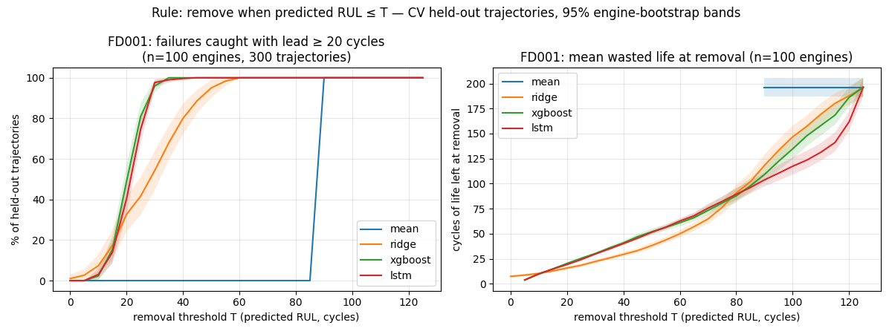
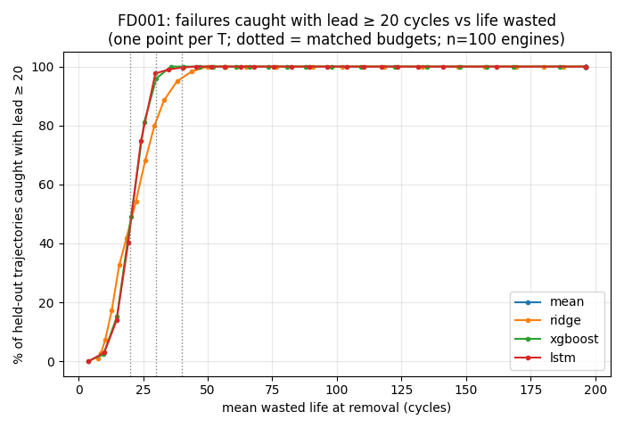

# Evaluation protocol v2 — description and sanity run

Produced by `python -m turbofan.evaluation.report_v2`; every number below is computed by that run from the training files. **No NASA test input was read** (the benchmark view used the test label histogram only).

## Protocol (D46)

Model selection never touches the NASA test set. Everything below runs on the **training
files** (`data.loader.load_train`); the only test-side input is the *label histogram* of
`RUL_FD00x.txt`, used to shape the benchmark view's sampling.

1. **Subpopulations (D35).** `analysis.subpopulation` reproduces data-audit §I's
   permutation-supported 2-way split (sign of each engine's sensor-vs-time-to-failure
   correlation over its full trajectory, KMeans k = 2). Used only to stratify folds and to
   split reports — never a model input (enforced by an import test).
2. **Folds.** Repeated `StratifiedGroupKFold` over training engines: groups = engine,
   stratified by subpopulation (`params.yaml` `cv`). Inside each fold a stratified share of
   the fold's training engines is held out for early stopping; every fitted state (regimes,
   normalization, envelope) is fitted on the remaining inner-training engines only.
3. **Views on held-out engines** (trajectories run to failure, so true RUL is known
   uncapped). *Deployment* (primary, selects models): a prediction at every cycle from
   `serving.min_history` on. *Benchmark* (secondary, comparability only): truncation points
   sampled per held-out fold so the true-RUL histogram matches the NASA test labels (audit §B),
   RUL above the cap included.
4. **Metrics**, each against capped and uncapped truth: RMSE, MAE, late %, mean signed error
   (prediction − truth), NASA score as a mean per engine, and per maintenance bucket RMSE,
   late %, signed error with n engines and n points. **Headline: critical-bucket RMSE,
   deployment view** (identical under both truths).
5. **Uncertainty.** Points within an engine are correlated, so every CI resamples engines
   (1,000 replicates), pooling all residuals of each drawn engine across repeats and seeds.
6. **Comparisons** (`evaluation.compare`) are paired — same engines, cycles, folds, seeds:
   the metric difference with a paired engine-bootstrap CI, per-engine differences, and a
   Wilcoxon signed-rank test over fold × seed results. Never pooled across datasets.
7. **Cap comparisons (D01).** Candidates with different `rul_cap` are compared only on
   critical-bucket RMSE or RMSE against uncapped truth; the comparison code refuses any other
   metric.
8. **Decision curves.** Rule "remove when predicted RUL ≤ T" run forward on held-out
   trajectories: % of failures caught with lead time ≥ L, % failing in service, mean wasted
   life (true RUL at removal), versus T. Models are compared at **matched operating points**
   (caught % at fixed wasted-life budgets, paired engine bootstrap), not at equal T, which is
   not like-for-like.
9. **Final evaluation** (`evaluation.final_eval`) is the one sealed test read per locked
   candidate: it refuses without `--confirm` or a `locked: true` spec, refuses a second run of
   the same spec, and logs `run_type=final_test`. Selection code may not import it.
10. **Tracking.** One MLflow parent run per model (`run_type=cv`) with aggregated metrics and
    CIs, one child run per fold × seed; device tags on every run (D43).

## Sanity run — FD001

Models at their current default configurations (`params.yaml` `models`), 5 folds × 3 repeats, seed 42, `rul_cap` 125. Subpopulation sizes: group 0: 60 engines, group 1: 40 engines. Devices: LSTM on cuda, XGBoost on cuda (NVIDIA GeForce RTX 4060 Laptop GPU). Wall-clock for the whole run: 5.7 min (fold features 108 s).

**Headline — critical_rmse, deployment view** (95% engine-bootstrap CI):

| model | critical_rmse [95% CI] | n engines | n points |
|---|---|---|---|
| mean | 75.19 [75.12, 75.27] | 100 | 7500 |
| ridge | 15.08 [13.62, 16.59] | 100 | 7500 |
| xgboost | 5.19 [4.78, 5.64] | 100 | 7500 |
| lstm | 4.37 [4.02, 4.74] | 100 | 7500 |

Benchmark view, same metric (secondary; matches the NASA test label histogram):

| model | critical_rmse [95% CI] | n engines | n points |
|---|---|---|---|
| mean | 72.94 [72.26, 73.69] | 93 | 277 |
| ridge | 16.14 [14.29, 18.37] | 93 | 277 |
| xgboost | 5.31 [4.67, 5.95] | 93 | 277 |
| lstm | 4.76 [4.25, 5.26] | 93 | 277 |

Benchmark-view bins no held-out trajectory could supply (target points short): none.

**Per subpopulation** — critical_rmse, deployment view:

| model | subpop_0 (n=60 engines) | subpop_1 (n=40 engines) |
|---|---|---|
| mean | 75.19 [75.10, 75.29] | 75.19 [75.06, 75.33] |
| ridge | 10.05 [8.95, 11.21] | 20.43 [18.59, 22.18] |
| xgboost | 4.76 [4.31, 5.20] | 5.78 [5.00, 6.60] |
| lstm | 4.06 [3.64, 4.48] | 4.81 [4.28, 5.34] |

**All metrics — deployment view, uncapped truth** (estimate [95% CI]):

| metric | mean | ridge | xgboost | lstm |
|---|---|---|---|---|
| rmse | 68.8 [62.6, 74.6] | 49.1 [42.2, 55.5] | 46.2 [38.9, 52.9] | 44.7 [37.3, 51.5] |
| mae | 55.4 [51.5, 59.4] | 34.0 [30.3, 37.8] | 29.8 [26.1, 33.8] | 28.2 [24.4, 32.3] |
| late_pct | 44.3 [42.4, 46.5] | 42.6 [38.3, 46.9] | 40.0 [35.3, 45.0] | 38.4 [33.8, 43.6] |
| mean_signed_error | -16.7 [-22.0, -11.0] | -18.5 [-24.1, -12.8] | -18.9 [-23.9, -13.5] | -18.8 [-23.7, -13.7] |
| nasa_mean_per_engine | not reported (D46) | not reported (D46) | not reported (D46) | not reported (D46) |
| critical_rmse | 75.2 [75.1, 75.3] | 15.1 [13.6, 16.6] | 5.2 [4.8, 5.6] | 4.4 [4.0, 4.7] |
| critical_late_pct | 100.0 [100.0, 100.0] | 63.1 [57.1, 69.1] | 70.1 [66.5, 74.1] | 65.0 [59.5, 70.1] |
| critical_mean_signed_error | 74.8 [74.8, 74.9] | 7.8 [5.9, 9.7] | 2.2 [1.7, 2.7] | 1.2 [0.6, 1.7] |
| urgent_rmse | 50.4 [50.3, 50.4] | 24.1 [22.1, 26.1] | 15.3 [13.4, 17.3] | 10.3 [8.9, 11.9] |
| monitor_rmse | 19.0 [19.0, 19.1] | 20.6 [19.0, 22.4] | 21.1 [19.7, 22.6] | 20.3 [18.8, 21.7] |
| healthy_rmse | 85.5 [76.0, 93.8] | 66.8 [57.5, 75.5] | 63.4 [53.7, 72.3] | 61.8 [51.7, 70.6] |

Deployment view, capped truth (what the models are trained to predict):

| metric | mean | ridge | xgboost | lstm |
|---|---|---|---|---|
| rmse | 41.9 [41.7, 42.0] | 19.8 [18.7, 21.0] | 15.7 [14.7, 16.7] | 14.0 [13.2, 14.9] |
| mae | 36.9 [36.9, 37.0] | 15.5 [14.4, 16.7] | 11.4 [10.6, 12.2] | 9.8 [9.1, 10.4] |
| late_pct | 44.3 [42.4, 46.2] | 42.6 [38.4, 46.6] | 40.0 [35.4, 44.5] | 38.4 [33.8, 43.2] |
| mean_signed_error | 1.7 [0.0, 3.5] | -0.0 [-2.5, 2.5] | -0.4 [-2.3, 1.5] | -0.4 [-1.9, 1.2] |
| nasa_mean_per_engine | 338.9 [324.8, 353.7] | 8.5 [6.8, 10.4] | 6.1 [4.8, 7.7] | 5.0 [3.9, 6.6] |
| critical_rmse | 75.2 [75.1, 75.3] | 15.1 [13.6, 16.4] | 5.2 [4.8, 5.6] | 4.4 [4.0, 4.7] |
| critical_late_pct | 100.0 [100.0, 100.0] | 63.1 [56.8, 68.8] | 70.1 [66.0, 74.5] | 65.0 [59.8, 70.2] |
| critical_mean_signed_error | 74.8 [74.8, 74.9] | 7.8 [5.9, 9.6] | 2.2 [1.7, 2.7] | 1.2 [0.6, 1.8] |
| urgent_rmse | 50.4 [50.3, 50.4] | 24.1 [22.0, 26.0] | 15.3 [13.3, 17.2] | 10.3 [8.8, 12.0] |
| monitor_rmse | 19.0 [19.0, 19.1] | 20.6 [18.8, 22.3] | 21.1 [19.5, 22.6] | 20.3 [18.8, 21.7] |
| healthy_rmse | 35.6 [35.2, 35.8] | 19.3 [17.0, 21.6] | 14.3 [12.7, 16.0] | 12.5 [11.2, 13.9] |

Points per bucket (deployment view; identical for every model):

| truth | bucket | n engines | n points |
|---|---|---|---|
| uncapped | critical | 100 | 7500 |
| uncapped | urgent | 100 | 7500 |
| uncapped | monitor | 100 | 15000 |
| uncapped | healthy | 100 | 29193 |
| capped | critical | 100 | 7500 |
| capped | urgent | 100 | 7500 |
| capped | monitor | 100 | 15000 |
| capped | healthy | 100 | 29193 |

**Paired comparisons** — critical_rmse, deployment view (negative Δ = A lower error):

| A − B | Δ critical_rmse [95% CI] | engines where A better | Wilcoxon p (fold × seed) |
|---|---|---|---|
| lstm − xgboost | -0.82 [-1.28, -0.38] | 63% of 100 | 0.0067 (n=15) |
| xgboost − ridge | -9.89 [-11.32, -8.59] | 100% of 100 | 6.1e-05 (n=15) |
| ridge − mean | -60.11 [-61.60, -58.74] | 100% of 100 | 6.1e-05 (n=15) |

**Decision curves** (rule: remove when predicted RUL ≤ T):

Same-T table — **not like-for-like**: the same T removes at different wasted life for different models, so differences here mix better prediction with a different operating point. Compare models in the matched-budget tables below.

| model | T (cycles) | caught_lead_ge_10_pct | caught_lead_ge_20_pct | caught_lead_ge_30_pct | failed_in_service_pct | mean_wasted_life |
|---|---|---|---|---|---|---|
| mean | 25 | 0.0 [0.0, 0.0] | 0.0 [0.0, 0.0] | 0.0 [0.0, 0.0] | 100.0 [100.0, 100.0] | — |
| mean | 50 | 0.0 [0.0, 0.0] | 0.0 [0.0, 0.0] | 0.0 [0.0, 0.0] | 100.0 [100.0, 100.0] | — |
| ridge | 25 | 89.0 [82.7, 94.0] | 41.7 [32.3, 51.0] | 8.0 [3.3, 13.3] | 0.3 [0.0, 1.0] | 18.5 [16.9, 20.1] |
| ridge | 50 | 100.0 [100.0, 100.0] | 95.0 [90.0, 99.0] | 66.3 [57.0, 75.3] | 0.0 [0.0, 0.0] | 38.1 [35.1, 41.2] |
| xgboost | 25 | 100.0 [100.0, 100.0] | 81.0 [73.7, 87.7] | 21.7 [15.0, 28.7] | 0.0 [0.0, 0.0] | 25.4 [24.3, 26.6] |
| xgboost | 50 | 100.0 [100.0, 100.0] | 100.0 [100.0, 100.0] | 96.7 [93.7, 99.3] | 0.0 [0.0, 0.0] | 51.9 [49.1, 54.9] |
| lstm | 25 | 100.0 [100.0, 100.0] | 74.7 [67.7, 80.7] | 17.7 [12.3, 23.3] | 0.0 [0.0, 0.0] | 24.2 [23.2, 25.1] |
| lstm | 50 | 100.0 [100.0, 100.0] | 100.0 [100.0, 100.0] | 99.3 [98.0, 100.0] | 0.0 [0.0, 0.0] | 51.4 [49.4, 53.4] |

**Trade-off curves** — caught share (lead ≥ 20 cycles) against mean wasted life, one point per T:

**Matched operating points** — each model read at the T where its mean wasted life equals the budget (linear interpolation along the T grid; 95% engine-bootstrap CI with the curve re-matched in every replicate):

| model | wasted-life budget | caught lead ≥ 20 (%) [95% CI] | n engines | bootstrap replicates defined |
|---|---|---|---|---|
| mean | 20 | budget not reached | 100 | 0% |
| mean | 30 | budget not reached | 100 | 0% |
| mean | 40 | budget not reached | 100 | 0% |
| ridge | 20 | 46.7 [41.2, 52.2] | 100 | 100% |
| ridge | 30 | 81.3 [75.5, 87.0] | 100 | 100% |
| ridge | 40 | 96.1 [92.7, 99.1] | 100 | 100% |
| xgboost | 20 | 47.0 [42.2, 51.4] | 100 | 100% |
| xgboost | 30 | 95.5 [91.6, 97.9] | 100 | 100% |
| xgboost | 40 | 100.0 [100.0, 100.0] | 100 | 100% |
| lstm | 20 | 45.4 [41.7, 49.9] | 100 | 100% |
| lstm | 30 | 97.7 [94.6, 99.3] | 100 | 100% |
| lstm | 40 | 99.6 [98.9, 100.0] | 100 | 100% |

Paired differences at matched budgets (same engines, folds, seeds; positive Δ = A catches more):

| A − B | wasted-life budget | Δ caught lead ≥ 20 (pp) [95% CI] | n engines | bootstrap replicates defined |
|---|---|---|---|---|
| lstm − xgboost | 20 | -1.5 [-5.7, 3.0] | 100 | 100% |
| lstm − xgboost | 30 | 2.2 [-1.0, 5.2] | 100 | 100% |
| lstm − xgboost | 40 | -0.4 [-1.0, 0.0] | 100 | 100% |
| xgboost − ridge | 20 | 0.3 [-6.1, 6.6] | 100 | 100% |
| xgboost − ridge | 30 | 14.2 [7.8, 19.3] | 100 | 100% |
| xgboost − ridge | 40 | 3.9 [0.8, 7.3] | 100 | 100% |
| ridge − mean | 20 | budget not reached by both | 100 | 0% |
| ridge − mean | 30 | budget not reached by both | 100 | 0% |
| ridge − mean | 40 | budget not reached by both | 100 | 0% |

**Wall-clock per model** (fit + predict, summed over folds × seeds):

| model | fit + predict, all folds (s) | per fit (s) | MLflow parent run |
|---|---|---|---|
| mean | 0 | 0.0 | `36bb25672c3048fb897448287b04460d` |
| ridge | 0 | 0.0 | `e70609f3e50d4ffaa40a7f69bc98d418` |
| xgboost | 10 | 0.6 | `cd88bba5de0d4f07a4dc68cf992f977e` |
| lstm | 128 | 8.6 | `8dee5362e50547318421b903013488db` |

## Compute estimate for the full sweep

| model | measured s / fit (FD001) | configs per dataset | fits | estimated hours |
|---|---|---|---|---|
| mean | 0.0 | 4 | 1200 | 0.0 |
| ridge | 0.0 | 4 | 1200 | 0.0 |
| xgboost | 0.6 | 4 | 1200 | 0.4 |
| lstm | 8.6 | 12 | 3600 | 16.6 |
| feature preparation | 7.2 per fold | 3 | 180 | 0.7 |

Total ≈ 17.8 h on this machine, assuming: 4 datasets, 5 folds × 3 repeats, 5 seeds (`params.yaml` `seeds`), 4 caps (`rul_cap_grid`), 3 sequence lengths for the LSTM (`seq_len_grid`), the four models of this run at default hyperparameters, per-fit time proportional to training rows, and feature preparation repeated per sequence-length setting (an upper bound: the window grid does not change the flat features). No hyperparameter search is included — each tuned configuration multiplies its model's row.

## Reproducibility

- Generated: 2026-10-03T10:34:15+00:00
- Git commit: `fb044b6667e977953a07472f43667bdb32c0dc3f`
- DVC data hash (`data/raw`): `43f328008844d7fd56733c63103d09ef.dir`
- Hardware: Intel64 Family 6 Model 183 Stepping 1, GenuineIntel, 28 logical CPUs; GPU NVIDIA GeForce RTX 4060 Laptop GPU (driver 581.86, CUDA driver 13.0, torch built for CUDA 13.0); resolved devices: torch (LSTM) on cuda, XGBoost on cuda; OS Windows-10-10.0.26200-SP0
- Threads: 20 (torch and all native pools pinned); torch deterministic algorithms: False; CUDA initialized: True
- Python 3.11.15

| Library | Version |
|---|---|
| numpy | 2.4.4 |
| pandas | 2.3.3 |
| scikit-learn | 1.8.0 |
| scipy | 1.17.1 |
| torch | 2.11.0+cu130 |
| xgboost | 3.2.0 |
| threadpoolctl | 3.6.0 |
| mlflow | 3.11.1 |

| Native thread pool | Implementation | Version | Threads |
|---|---|---|---|
| libscipy_openblas-64eda39e79589aedb16f58e5547eb599.dll | openblas (blas) | 0.3.30 | 24 |
| libscipy_openblas64_-63c857e738469261263c764a36be9436.dll | openblas (blas) | 0.3.31.188.0 | 24 |
| libiomp5md.dll | openmp (openmp) | None | 20 |
| libiompstubs5md.dll | openmp (openmp) | None | 1 |
| vcomp140.dll | openmp (openmp) | None | 28 |

| Stochastic step | Seed |
|---|---|
| model_seed_42 | 42 |
| cv_seed | 0 |
| bootstrap_and_views_seed | 42 |

Pipeline constants in effect: `cfg_REGIME_KMEANS_N_INIT=10`, `cfg_REGIME_KMEANS_SEED=0`, `cfg_SEED=42`, `cfg_SEEDS=(42, 7, 123, 2024, 99)` (full `turbofan.config` in the JSON sidecar).
